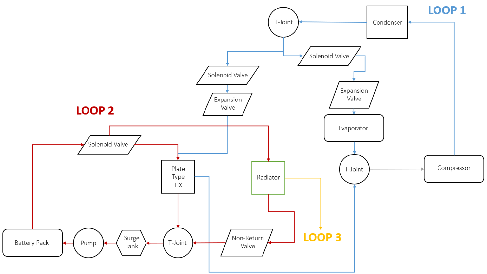
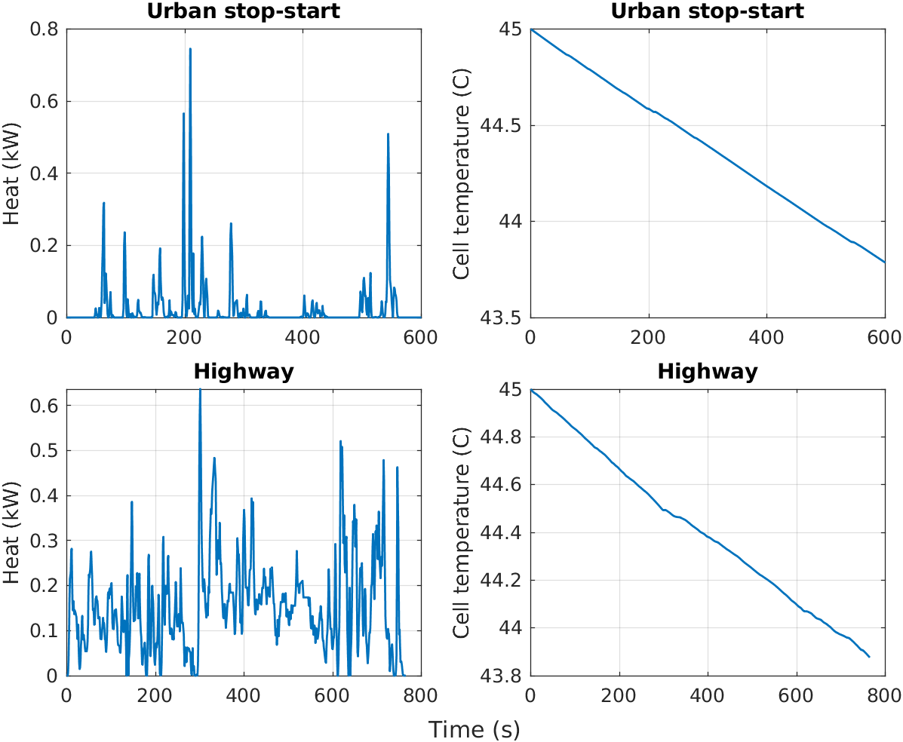

# EV Thermal Analysis Framework

[](https://github.com/Hussnain-Al/ev-thermal-analysis-framework/actions/workflows/matlab.yml)
[](LICENSE)

Modular MATLAB screening model for a compact battery-electric SUV operating
under Karachi hot-weather conditions. Version `3.0.0` separates heat
generation, cooling hardware, and shared-capacity decisions so every subsystem
can be tested, replaced, or moved into Simulink without rewriting the others.

This is an engineering sizing model, not a validated vehicle model. Its end
state is experimental comparison of predicted heat, temperature, flow and
pressure loss against measurements with stated uncertainty.

## Run

MATLAB R2022b or later; Base MATLAB only:

```matlab
results = verify_framework;
```

The five result domains are:

```matlab
results.motorHeat
results.motorCooling
results.batteryCooling
results.cabinCooling
results.sharedCompressor
```

The current cabin/battery/compressor decision is exported to:

```text
outputs/shared_compressor/shared_cooling_current_result.csv
```

See [`docs/RESULT_FILES.md`](docs/RESULT_FILES.md) for the module-by-module
output contract and the meaning of the merged screening result.

## Architecture

### System cooling loops



### Propulsion coolant loop


| Module | Own parameters | Main output |
|---|---|---|
| `motor_heat` | Vehicle, torque/power curves, efficiency map | Time-aligned DC-link power and integrated-drive heat |
| `motor_cooling` | Coolant, hose network, pump point, radiator boundaries | Coolant rise, required radiator `UA`, pressure loss |
| `battery_cooling` | Pack voltage, resistance, thermal paths, thresholds | Battery heat, cell temperature, plate request |
| `cabin_cooling` | Karachi ambient, hot-soak, humidity, cabin load | Independent cabin cooling requirement |
| `shared_compressor` | R134a map, candidates, allocation rule | Combined battery/cabin capacity margin |

Each module has a matching file under `config/`, `data/`, `modules/`, and
`outputs/`. The shared compressor receives completed battery and cabin result
structs; those two modules never read each other's parameters.

## MATLAB results

### Motor heat generation


### Battery heat and cell temperature



### Propulsion-loop pressure loss


## Repository layout

```text
config/                         one parameter file per subsystem
data/
  common/cycles/                verified EPA time-speed files
  motor_heat/                   original torque workbook and efficiency map
  motor_cooling/                radiator, pump and thermal references
  battery_cooling/              battery cases and exchanger geometry
  cabin_cooling/                recovered cabin-load inputs
  shared_compressor/            original compressor table and candidates
modules/                        five subsystem entry points
src/calculations/               reusable equations without component ratings
src/io/                         deterministic CSV reader
src/validation/                 input and interface validation
tests/                          regression and module-boundary checks
references/                     source audit and online primary references
outputs/                        generated module folders
```

## Source control

The original torque/power workbook is retained unchanged, including its native
charts. The compressor table, inactive-pump curve, radiator geometry, battery
values and cabin subtotal are traceable to the archived project files. The old
ADVISOR NYCC `.mat` case is preserved as historical evidence but excluded from
the active model because it represents a 58 kW motor and a NiMH battery.

See [`references/SOURCE_PROVENANCE.md`](references/SOURCE_PROVENANCE.md) for
hashes, evidence roles, limitations, official EPA cycle links, and the
MathWorks/NREL/SAE references.

Detailed source figures are separated into the
[`battery thermal model`](docs/BATTERY_THERMAL_MODEL.md) and
[`cabin cooling model`](docs/CABIN_COOLING_MODEL.md) documentation.

## Karachi boundary

The current design screen uses a 45 C ambient and an 80 C cabin hot-soak. The
recovered cabin workbook supplies only a partial sensible subtotal. Solar,
latent, ventilation, transient pull-down, condenser derating and detailed
refrigerant states remain validation work; the code labels these boundaries
instead of converting them into false precision.

## MATLAB or Simulink

Keep MATLAB as the authoritative sizing and regression layer. Add Simulink with
Simscape Fluids and Simscape Battery when the work requires pump/fan/compressor
control, refrigerant state dynamics, thermal masses, valve switching, or
hardware-in-the-loop testing. The staged model boundary is defined in
[`docs/SIMULINK_EXTENSION.md`](docs/SIMULINK_EXTENSION.md).

## Release state

Version `3.0.0` passed `verify_framework` in MATLAB R2024b on GitHub Actions.
That check covers the full calculation run, output completeness, numerical
regressions, input schemas and module interfaces.

## Citation

> Ali, H. (2026). *EV Thermal Analysis Framework* [Computer software].
> https://github.com/Hussnain-Al/ev-thermal-analysis-framework
