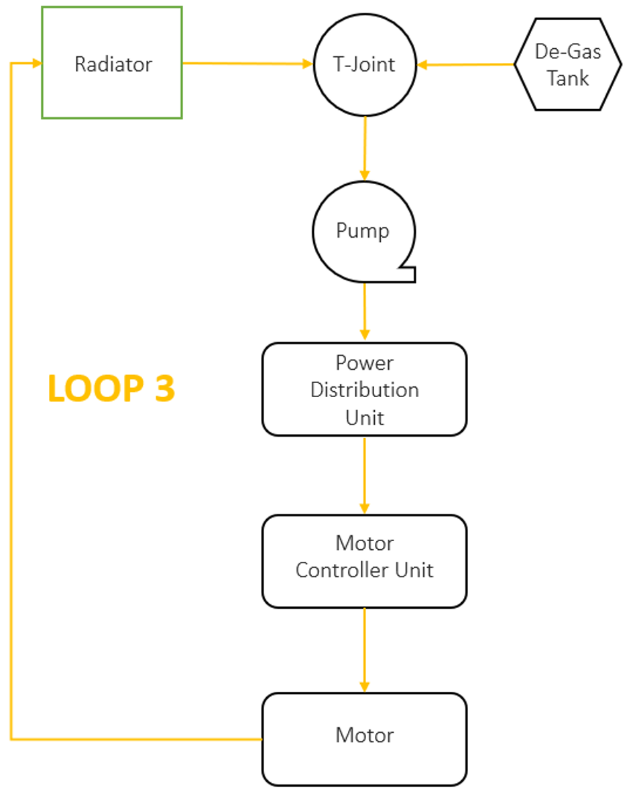
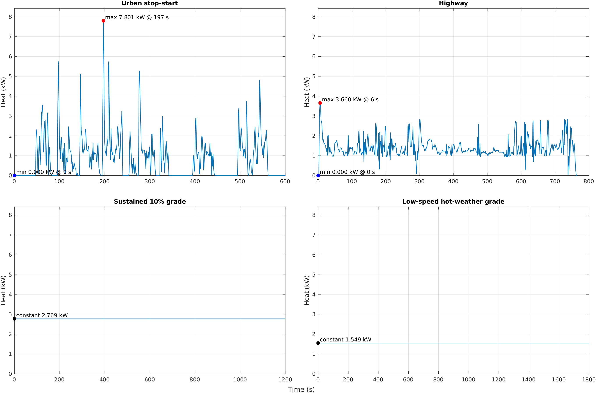
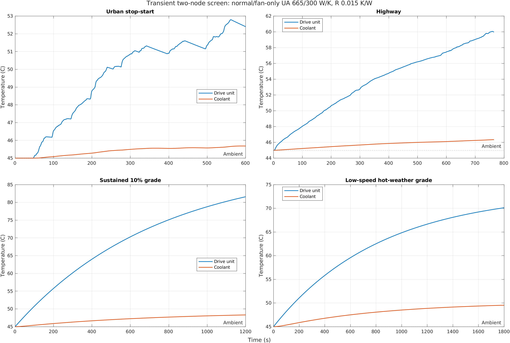
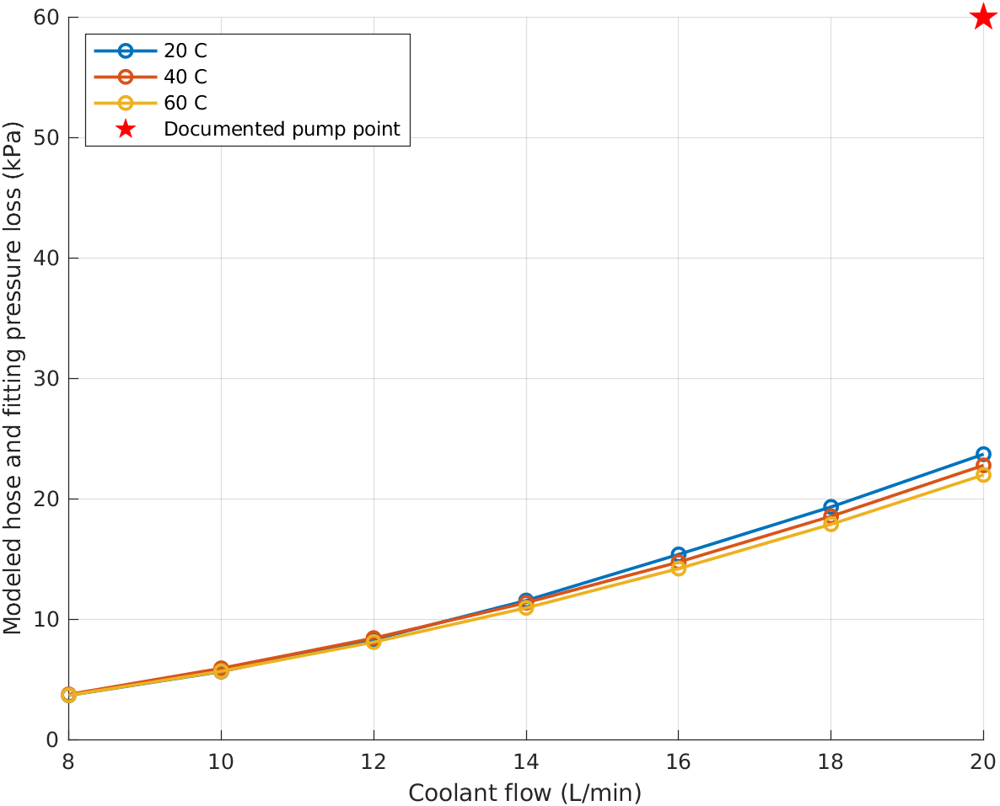
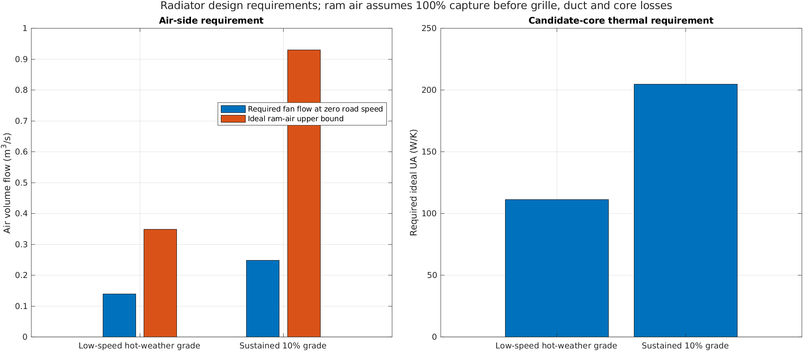
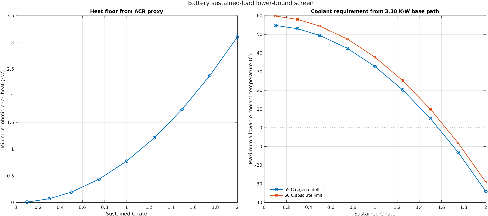
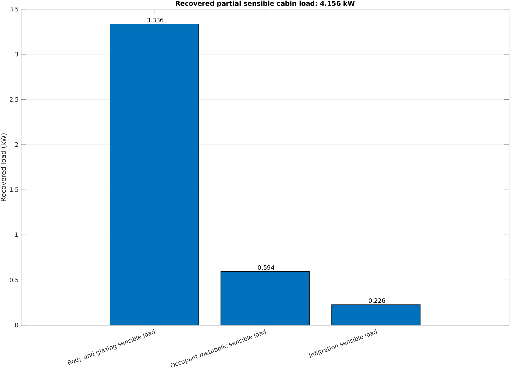

# EV Thermal Analysis Framework

[](https://github.com/Hussnain-Al/ev-thermal-analysis-framework/actions/workflows/matlab.yml)
[](LICENSE)

Modular MATLAB screening model for a compact battery-electric SUV under a
45 C Karachi hot-weather boundary. Version `4.3.0` contains four independent
domains: motor heat, transient propulsion cooling, sustained battery thermal
screening and the recovered cabin-load calculation.

This is not a validated vehicle model. Unmeasured thermal parameters remain
explicit assumptions for future experimental calibration.

The result figures below were generated by the successful public MATLAB
R2024b verification workflow.

## Run

MATLAB R2022b or later; Base MATLAB is sufficient for the numerical framework:

```matlab
results = verify_framework;
```

```matlab
results.motorHeat
results.motorCooling
results.batteryCooling
results.cabinCooling
```

The standalone battery requirements screen additionally uses Simulink:

```matlab
cfg = setup_project();
modelFile = build_battery_requirements_simulink(cfg);
open_system(modelFile);
```

The separate propulsion thermal sensitivity model uses the calculated
drive-unit heat as its input:

```matlab
modelFile = build_propulsion_thermal_sensitivity_simulink(cfg);
open_system(modelFile);
```

## Propulsion coolant loop



| Module | Result |
|---|---|
| `motor_heat` | Drive-unit heat for NYCC, HWFET and two hot-weather operating cases |
| `motor_cooling` | Two-node sensitivity, six-hose pressure loss and radiator/fan requirements |
| `battery_cooling` | Sustained ACR-based heat floor and coolant-temperature requirement |
| `cabin_cooling` | Independent recovered cabin sensible-load subtotal |

The compressor and battery/cabin allocation model were removed. The former
battery drive-cycle temperature result was also removed because it was
dominated by its imposed initial temperature and fixed coolant boundary.

## Motor heat



The model uses the original torque/power workbook and digitized integrated
drive-unit efficiency surface. The supplied controller figure is retained as
a separate cross-check: 1.580 kW loss at 60 kW output and 3.218 kW at 125 kW.
Those controller-only values are not added to the integrated three-in-one heat
map. NYCC and HWFET are supplemented by:

| Case | Speed | Grade | Duration | Ambient |
|---|---:|---:|---:|---:|
| Sustained grade | 40 km/h | 10% | 20 min | 45 C |
| Low-speed hot-weather grade | 15 km/h | 5% | 30 min | 45 C |

## Transient motor and coolant screen



The two-node model balances generated heat, heat transferred to coolant,
radiator rejection and stored energy. Its thermal capacitances, motor-to-coolant
resistance and radiator `UA` are calibration assumptions, not measured component
properties. The 83.5 kg drive-unit mass is known; the assumed 45 kJ/K capacity
corresponds to an effective 539 J/(kg K). ADC12 describes the outer casing, not
the whole internal assembly. The output is a sensitivity screen rather than a
temperature-limit verdict. The low-speed case uses a separate assumed fan-only
`UA`.

## Propulsion-loop hydraulics



| Flow | Documented pump head | Hose/fitting loss at 60 C | Head left for unmodeled items |
|---:|---:|---:|---:|
| 20 L/min | 60.0 kPa | 21.98 kPa | 38.02 kPa |

The documented point covers the six modeled 20 mm hoses and their fittings.
Motor, controller, PDU and radiator pressure drops are excluded. Therefore this
is not a complete pump verdict, and the inactive-pump resistance curve is not
misused as active pump head.

## Radiator and fan design requirements



The retained 270 by 310 mm, 0.0837 m2 core geometry is an unbuilt design
candidate. The sustained-grade and low-speed hot-weather cases calculate:

- required heat rejection;
- coolant outlet temperature at 20 L/min;
- ideal counterflow `UA` requirement;
- complete fan-flow requirement at zero road speed;
- ideal ram-air upper bound from core area and vehicle speed.

| Design case | Heat duty | Coolant out | Required ideal UA | Fan flow at zero speed | Ideal ram-air bound | Required capture |
|---|---:|---:|---:|---:|---:|---:|
| 10% grade at 40 km/h | 2.769 kW | 62.78 C | 204.8 W/K | 0.248 m3/s | 0.930 m3/s | 26.7% |
| 5% grade at 15 km/h | 1.549 kW | 63.76 C | 111.3 W/K | 0.139 m3/s | 0.349 m3/s | 39.8% |

The ram-air value assumes 100% capture before grille, duct and core losses. It
is an upper bound, not predicted installed airflow. Actual core performance and
fan selection require CFD, a validated radiator correlation or a prototype test.

## Sustained battery thermal screen



The only available resistance is the SVOLT limit of 0.40 mOhm ACR at 1 kHz,
25 C and 60% SOC. Therefore the calculated `I^2R` value is a minimum ohmic heat
floor, not a DC heat estimate.

The graph reports the maximum coolant temperature compatible with the
reconstructed 3.10 K/W base path at:

- 55 C, above which the SVOLT continuous-charge table prohibits charging;
- 60 C, the absolute operating protection limit.

The severe coolant requirement above roughly 1.25C conflicts with the SVOLT
2C continuous-discharge rating. This identifies the reconstructed 3.10 K/W
thermal path as requiring validation; it does not prove that the cell cannot
operate at 2C.

The Simulink battery requirements screen implements this same calculation
with one sustained C-rate input and six outputs. It does not add a coolant
temperature, transient battery state or cooling-component model. See
[`models/battery_requirements/README.md`](models/battery_requirements/README.md).

## Cabin load



The body and glazing subtotal is read from the original
`Cabin_Cooling_Load_AutoRecovered.xlsx` workbook. Occupant and infiltration
terms remain in the derived input table. The result excludes a complete solar,
latent, ventilation and transient pull-down model.

## Repository layout

```text
config/                  independent domain parameters
data/common/cycles/      EPA NYCC and HWFET schedules
data/motor_heat/         original torque workbook and efficiency map
data/motor_cooling/      pump, radiator and motor reference data
data/cabin_cooling/      recovered cabin workbook and derived inputs
modules/                 four domain entry points
models/battery_requirements/ standalone Simulink battery screen
models/propulsion_thermal_sensitivity/ standalone two-node sensitivity model
src/calculations/        reusable equations
tests/                   regression, interface and energy-balance checks
references/              source provenance and retained project figures
outputs/                 generated results
```

See [`docs/METHODOLOGY.md`](docs/METHODOLOGY.md),
[`docs/RESULT_FILES.md`](docs/RESULT_FILES.md) and
[`references/SOURCE_PROVENANCE.md`](references/SOURCE_PROVENANCE.md). The exact
data still required for physical loop models is listed in
[`docs/MISSING_MODEL_INPUTS.md`](docs/MISSING_MODEL_INPUTS.md).

## Citation

> Ali, H. (2026). *EV Thermal Analysis Framework* [Computer software].
> https://github.com/Hussnain-Al/ev-thermal-analysis-framework
