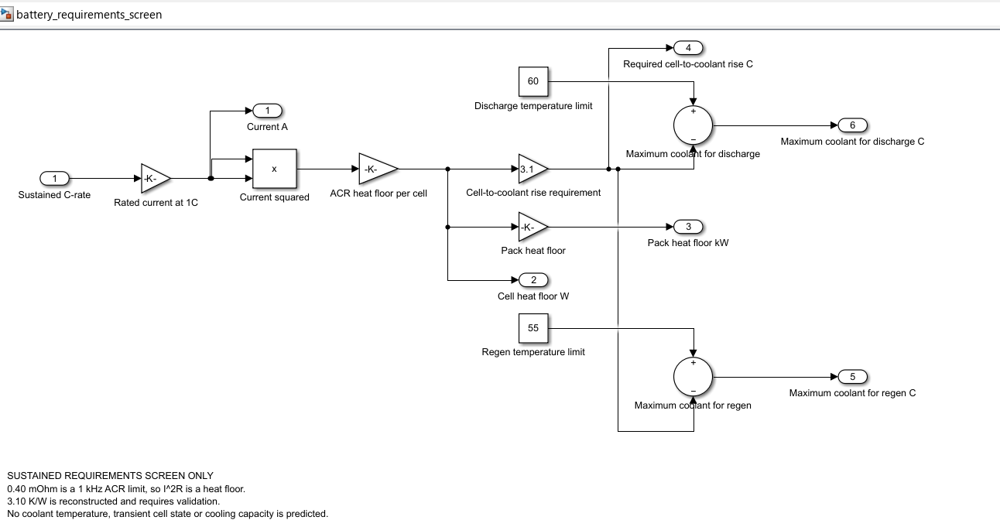
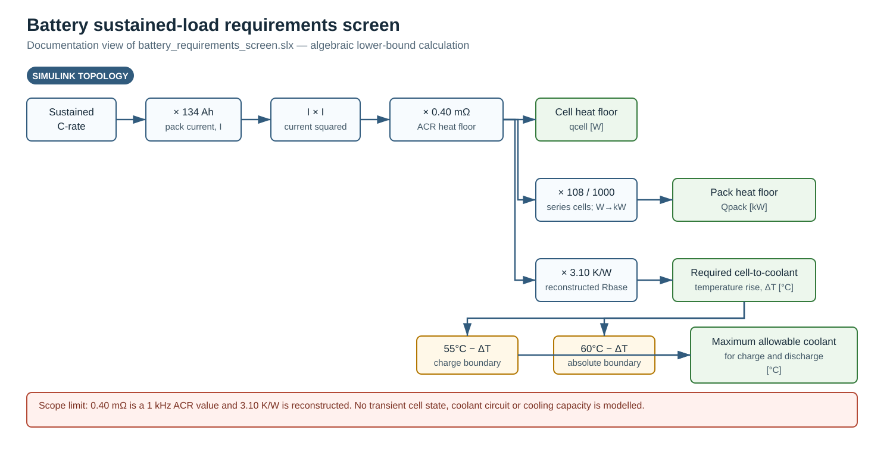
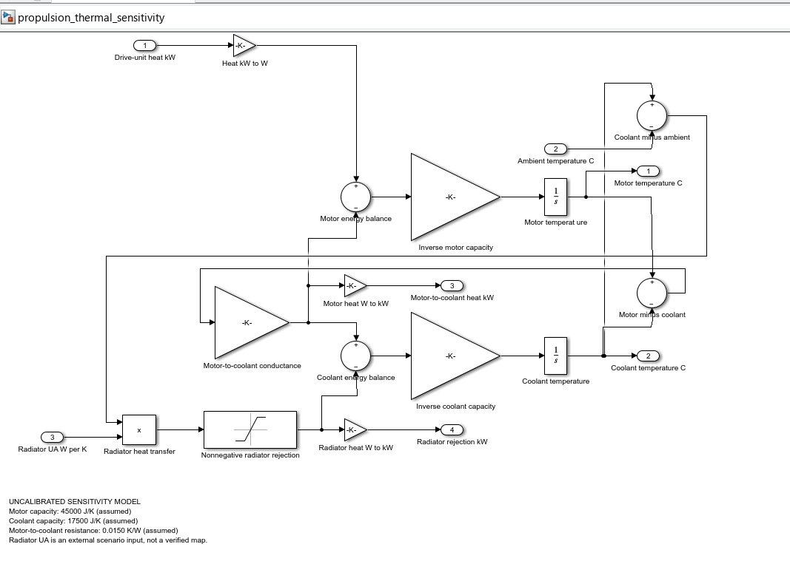
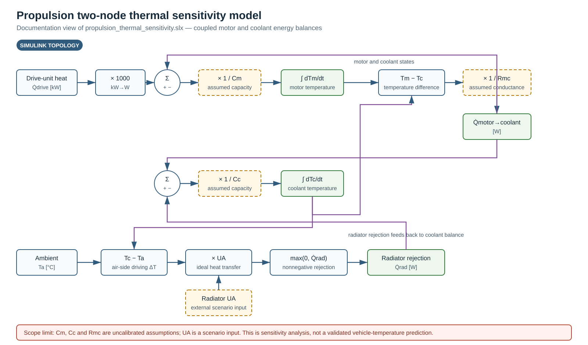
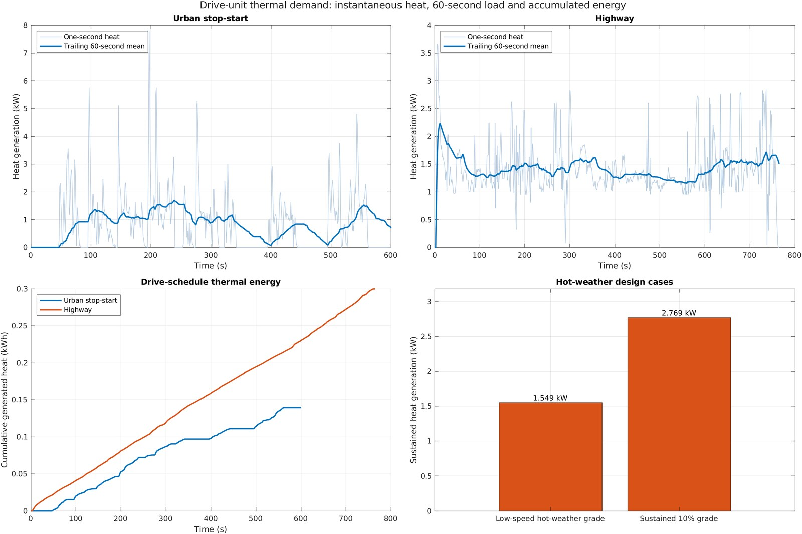
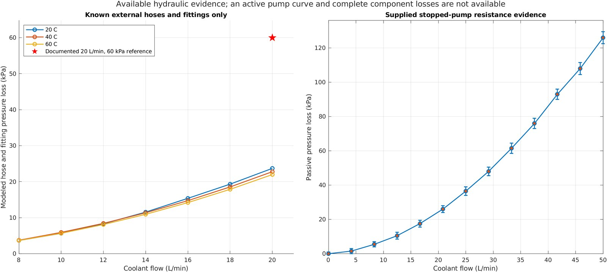
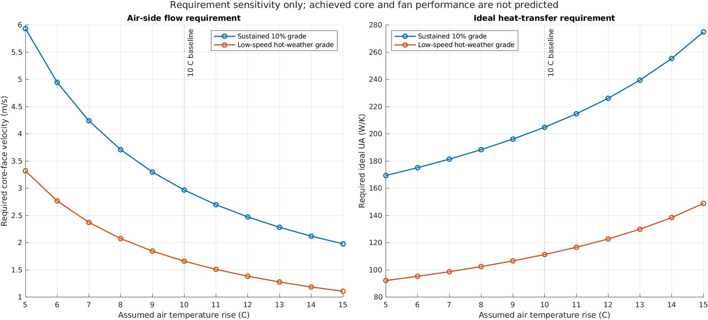

# EV Thermal Analysis Framework

[](https://github.com/Hussnain-Al/ev-thermal-analysis-framework/actions/workflows/matlab.yml)
[](LICENSE)

Modular MATLAB screening model for a compact battery-electric SUV under a
45 C Karachi hot-weather boundary. Version `4.4.2` contains four independent
domains: motor heat, transient propulsion cooling, sustained battery thermal
screening and the recovered cabin-load calculation.

This is not a validated vehicle model. Unmeasured thermal parameters remain
explicit assumptions for future experimental calibration.

All generated plots are shown below, grouped by evidence strength. Calculated
requirements are kept separate from uncalibrated sensitivities and recovered
workbook results. The public MATLAB R2024b workflow reproduces every result
file.

## Run

MATLAB R2022b or later; Base MATLAB is sufficient for the numerical framework:

```matlab
results = verify_framework;
```

```matlab
results.motorHeat
results.motorCooling
results.batteryCooling
results.cabinCooling
```

The standalone battery requirements screen additionally uses Simulink:

```matlab
cfg = setup_project();
modelFile = build_battery_requirements_simulink(cfg,Overwrite=true);
open_system(modelFile);
```

The separate propulsion thermal sensitivity model uses the calculated
drive-unit heat as its input:

```matlab
modelFile = build_propulsion_thermal_sensitivity_simulink( ...
    cfg,Overwrite=true);
open_system(modelFile);
```

## Output map

| Output | What it answers | Evidence status |
|---|---|---|
| Drive-unit heat | How much heat is generated over each schedule and sustained case? | Calculated from the supplied efficiency surface |
| Hose hydraulics | How much of the documented pump head is consumed by known hoses and fittings? | Calculated partial loop only |
| Radiator requirements | What ideal `UA` and face velocity would the unbuilt core require? | Design requirement, not achieved performance |
| Battery sustained screen | What minimum heat and coolant-temperature boundary follow from the available ACR and thermal path? | Lower-bound requirements screen |
| Motor/coolant temperatures | How do assumed thermal parameters affect two-node temperatures? | Uncalibrated sensitivity only |
| Cabin-load breakdown | What does the recovered Excel workbook currently sum? | Partial sensible-load reconstruction |
| Simulink models | How are the battery and propulsion equations connected? | Generated models compile-checked in MATLAB R2024b |

## Simulink block diagrams

### Battery sustained-load requirements screen



This is the actual generated model opened in MATLAB Online. Version `4.4.2`
renames the blocks as explicit actions—such as `Convert C-rate to pack current`
and `Calculate cell ACR heat floor`—without changing the connections or gains.

Readable calculation topology:



| Block group | Function |
|---|---|
| C-rate → current | Multiplies sustained C-rate by the 134 Ah capacity |
| Current → cell heat | Squares current and multiplies by the 0.40 mOhm ACR proxy |
| Cell heat → pack heat | Multiplies by 108 series cells and converts W to kW |
| Cell heat → required temperature difference | Multiplies by the reconstructed 3.10 K/W base path |
| Temperature limits → coolant boundary | Subtracts the required temperature difference from the 55 C charge and 60 C absolute limits |

The model has no transient battery state, coolant circuit or cooling component.

### Propulsion thermal sensitivity model



This is the actual generated two-node model opened in MATLAB Online. Version
`4.4.2` replaces short labels such as `Inverse motor capacity` with physical
actions such as `Divide by motor thermal capacity`.

Readable energy-flow topology:



| Block group | Function |
|---|---|
| Motor heat balance | Drive-unit heat minus heat transferred to coolant |
| Motor temperature state | Divides net motor heat by assumed motor thermal capacity and integrates it |
| Motor-to-coolant transfer | Uses the motor/coolant temperature difference and assumed thermal resistance |
| Coolant heat balance | Motor-to-coolant heat minus ideal radiator rejection |
| Radiator rejection | Multiplies coolant-to-ambient difference by the scenario `UA` and prevents negative rejection |

The thermal capacitances and motor-to-coolant resistance are uncalibrated
assumptions. The model is for parameter sensitivity only and does not predict
validated vehicle temperatures.

## Propulsion coolant loop


| Module | Result |
|---|---|
| `motor_heat` | Drive-unit heat for NYCC, HWFET and two hot-weather operating cases |
| `motor_cooling` | Six-hose pressure loss and radiator requirement sensitivity |
| `battery_cooling` | Sustained ACR-based heat floor and coolant-temperature requirement |
| `cabin_cooling` | Independent recovered cabin sensible-load subtotal |

The compressor and battery/cabin allocation model were removed. The former
battery drive-cycle temperature result was also removed because it was
dominated by its imposed initial temperature and fixed coolant boundary.

## Motor heat



The figure answers four different questions without treating them as the same
quantity:

| Panel | Interpretation |
|---|---|
| One-second heat | Instantaneous loss calculated at each schedule sample |
| Trailing 60-second mean | Heat load sustained long enough to matter more than a single spike |
| Cumulative heat | Thermal energy added over the complete drive schedule |
| Hot-weather design cases | Constant heat duty for the specified sustained grade and duration |

The model uses the original torque/power workbook and digitized integrated
drive-unit efficiency surface. The supplied controller figure is retained as
a separate cross-check: 1.580 kW loss at 60 kW output and 3.218 kW at 125 kW.
Those controller-only values are not added to the integrated three-in-one heat
map. NYCC and HWFET are supplemented by:

| Case | Speed | Grade | Duration | Ambient |
|---|---:|---:|---:|---:|
| Sustained grade | 40 km/h | 10% | 20 min | 45 C |
| Low-speed hot-weather grade | 15 km/h | 5% | 30 min | 45 C |

### Motor/coolant parameter sensitivity


The four panels show what the assumed two-node model produces for NYCC, HWFET,
the sustained 10% grade and the low-speed hot-weather grade. The curves are
useful for locating sensitivity to sustained heat duration. They are not used
for a temperature-limit verdict because motor thermal capacity,
motor-to-coolant resistance, coolant thermal capacity and achieved radiator
`UA` have not been measured.

## Propulsion-loop hydraulics



| Flow | Documented pump head | Hose/fitting loss at 60 C | Head left for unmodeled items |
|---:|---:|---:|---:|
| 20 L/min | 60.0 kPa | 21.98 kPa | 38.02 kPa |

The left panel is a calculated system curve for the six known 20 mm hoses and
their fittings. The 20 L/min, 60 kPa marker is the only documented active-pump
reference point; it is not a pump curve. The right panel is the supplied
stopped-pump passive resistance curve and is not used as active pump head.
Motor, controller, PDU and radiator losses are unknown, so no operating-point
intersection or complete pump verdict is claimed.

## Radiator air-side requirements



The retained core is an unbuilt 270 by 310 by approximately 26 mm design
candidate with a 0.0837 m2 frontal area. The source drawing describes 31 flat
tubes with a 26 by 2 mm external cross-section. The 20 mm internal diameter
belongs to the six external coolant hoses; it is not the bore of each radiator
tube. A [comparable tested automotive radiator](https://doi.org/10.30939/ijastech..914901)
reports a 0.2 mm tube wall and 0.1 mm fin thickness, so those two values are
retained only as literature screening assumptions and do not determine
achieved `UA` in this model.

The sustained-grade and low-speed hot-weather cases calculate:

- required heat rejection;
- coolant outlet temperature at 20 L/min;
- ideal counterflow `UA` requirement;
- required air mass and volume flow;
- required face velocity for the candidate frontal area.

| Design case | Heat duty | Coolant out | Required ideal UA | Required air flow | Required face velocity |
|---|---:|---:|---:|---:|---:|
| 10% grade at 40 km/h | 2.769 kW | 62.78 C | 204.8 W/K | 0.248 m3/s | 2.97 m/s |
| 5% grade at 15 km/h | 1.549 kW | 63.76 C | 111.3 W/K | 0.139 m3/s | 1.66 m/s |

Those table values use a 10 C air-temperature-rise boundary. The figure varies
that assumption from 5 to 15 C and shows how the required face velocity and
ideal `UA` move. Vehicle speed is deliberately absent: without an installation
or fan model, road speed cannot be converted into actual core flow.
Achieved radiator performance remains unverified until a selected core has a
supplier map or a prototype heat-rejection test.

## Sustained battery thermal screen


The only available resistance is the SVOLT limit of 0.40 mOhm ACR at 1 kHz,
25 C and 60% SOC. Therefore the calculated `I^2R` value is a minimum ohmic heat
floor, not a DC heat estimate.

The graph reports the maximum coolant temperature compatible with the
reconstructed 3.10 K/W base path at:

- 55 C, above which the SVOLT continuous-charge table prohibits charging;
- 60 C, the absolute operating protection limit.

The severe coolant requirement above roughly 1.25C conflicts with the SVOLT
2C continuous-discharge rating. This identifies the reconstructed 3.10 K/W
thermal path as requiring validation; it does not prove that the cell cannot
operate at 2C.

The Simulink battery requirements screen implements this same calculation
with one sustained C-rate input and six outputs. It does not add a coolant
temperature, transient battery state or cooling-component model. See
[`models/battery_requirements/README.md`](models/battery_requirements/README.md).

## Recovered cabin-load subtotal


This plot reproduces the current Excel subtotal: body/glazing sensible load,
occupant metabolic sensible load and infiltration sensible load. The 4.156 kW
sum is not a complete air-conditioning requirement because the workbook does
not close the full solar, latent, ventilation or transient pull-down load. No
compressor is selected or evaluated.

## Repository layout

```text
config/                  independent domain parameters
data/common/cycles/      EPA NYCC and HWFET schedules
data/motor_heat/         original torque workbook and efficiency map
data/motor_cooling/      pump, radiator and motor reference data
data/cabin_cooling/      recovered cabin workbook and derived inputs
modules/                 four domain entry points
models/battery_requirements/ standalone Simulink battery screen
models/propulsion_thermal_sensitivity/ standalone two-node sensitivity model
src/calculations/        reusable equations
tests/                   regression, interface and energy-balance checks
references/              source provenance and retained project figures
outputs/                 generated results
docs/images/simulink/    model screenshots and readable topology diagrams
```

See [`docs/METHODOLOGY.md`](docs/METHODOLOGY.md),
[`docs/GRAPH_INTERPRETATION.md`](docs/GRAPH_INTERPRETATION.md),
[`docs/RESULT_FILES.md`](docs/RESULT_FILES.md) and
[`references/SOURCE_PROVENANCE.md`](references/SOURCE_PROVENANCE.md). The exact
data still required for physical loop models is listed in
[`docs/MISSING_MODEL_INPUTS.md`](docs/MISSING_MODEL_INPUTS.md).

## Citation

> Ali, H. (2026). *EV Thermal Analysis Framework* [Computer software].
> https://github.com/Hussnain-Al/ev-thermal-analysis-framework
