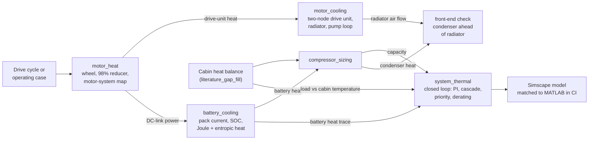
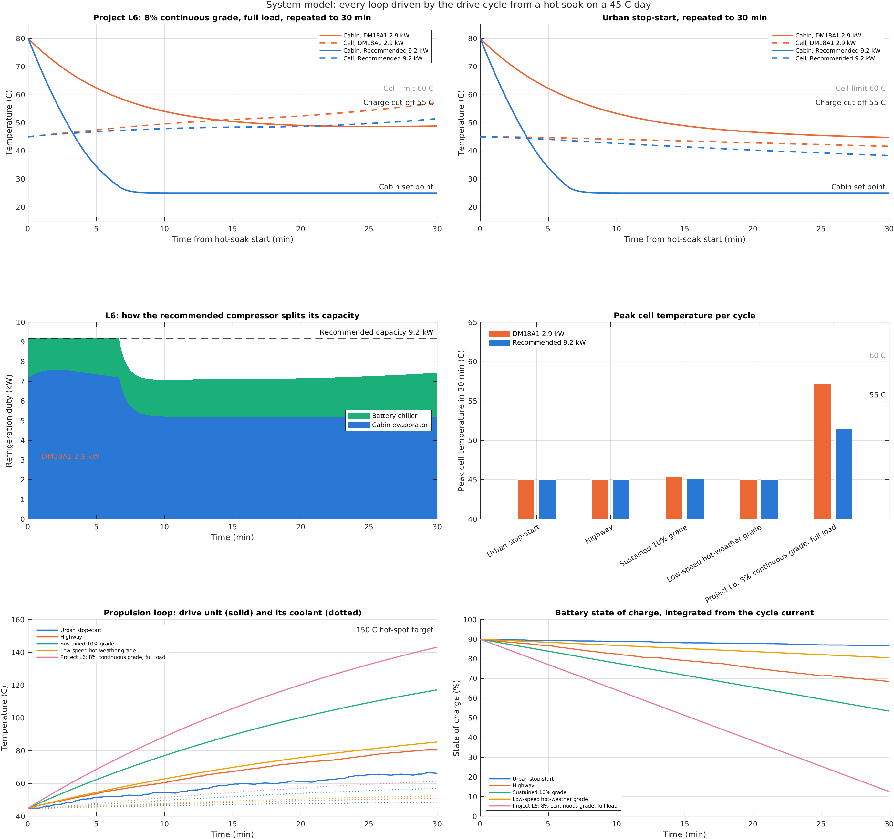

# EV Thermal Analysis Framework

[](https://github.com/Hussnain-Al/ev-thermal-analysis-framework/actions/workflows/matlab.yml)
[](LICENSE)

Modular MATLAB screening model for a compact battery-electric SUV under a
45 C Karachi hot-weather boundary. Version `4.7.0` contains four independent
domains: motor heat, transient propulsion cooling, sustained battery thermal
screening and the recovered cabin-load calculation.

This is not a validated vehicle model. Version `4.7.0` corrects six inputs
that did not hold up: the battery cell-to-coolant path, battery heat, radiator
UA, winding resistance, the cabin workbook and the design humidity. Each
replacement is derived from project evidence plus a sourced literature
register. Each is tested against its assumption ranges, and its superseded
value is kept for comparison. Version `4.6.0` also takes every number the
project's supplier documents give (thermal pad, drive-unit rated and peak
points, reducer efficiency, component pressure drops, compressor rating) in
place of the earlier assumptions, and checks the battery resistance against a
vendor rate test. Version `4.7.0` closes the loop: PI thermal management with
anti-windup, a cell-temperature cascade, compressor priority and BMS and
motor derating, in MATLAB and in Simscape
([`docs/CONTROLS.md`](docs/CONTROLS.md)). The argument for every correction is in
[`docs/CORRECTIONS.md`](docs/CORRECTIONS.md).

All plots below are PNG outputs of the MATLAB R2024b workflow, committed by
the `Publish MATLAB figures` workflow.

## How the modules connect


```mermaid
flowchart LR
    DC["Drive cycle or<br/>operating case"] --> MH["motor_heat<br/>wheel, 98% reducer,<br/>motor-system map"]
    MH -- "drive-unit heat" --> MC["motor_cooling<br/>two-node drive unit,<br/>radiator, pump loop"]
    MH -- "DC-link power" --> BC["battery_cooling<br/>pack current, SOC,<br/>Joule + entropic heat"]
    CAB["Cabin heat balance<br/>(literature_gap_fill)"] --> CS["compressor_sizing"]
    BC -- "battery heat" --> CS
    CS -- "capacity" --> SYS["system_thermal<br/>closed loop: PI, cascade,<br/>priority, derating"]
    BC -- "battery heat trace" --> SYS
    CAB -- "load vs cabin temperature" --> SYS
    MC -- "radiator air flow" --> FE["front-end check<br/>condenser ahead<br/>of radiator"]
    CS -- "condenser heat" --> FE
    SYS --> SIM["Simscape model<br/>matched to MATLAB in CI"]
```

One drive cycle feeds every loop on the same time base. The propulsion loop
has its own radiator (three loops, as in the project design brief); the
cabin and battery loops are coupled through the shared compressor; the
condenser and radiator are coupled through the front-end air stream.

## Run

MATLAB R2022b or later; Base MATLAB is sufficient for the numerical framework:

```matlab
results = verify_framework;
```

```matlab
results.motorHeat
results.motorCooling
results.batteryCooling
results.cabinCooling
results.compressorSizing
results.systemThermal
```

The coupled system model as a Simscape network (needs Simscape):

```matlab
build_system_thermal_simscape(cfg,results.systemThermal,Overwrite=true);
```

The standalone battery requirements screen additionally uses Simulink:

```matlab
cfg = setup_project();
modelFile = build_battery_requirements_simulink(cfg,Overwrite=true);
open_system(modelFile);
```

The separate propulsion thermal sensitivity model uses the calculated
drive-unit heat as its input:

```matlab
modelFile = build_propulsion_thermal_sensitivity_simulink( ...
    cfg,Overwrite=true);
open_system(modelFile);
```

## Output map

| Output | What it answers | Evidence status |
|---|---|---|
| Drive-unit heat | How much heat is generated over each schedule and sustained case? | Calculated from the supplied efficiency surface |
| Hose hydraulics | How much of the documented pump head is consumed by known hoses and fittings? | Calculated partial loop only |
| Radiator requirements | What ideal `UA` and face velocity would the unbuilt core require? | Design requirement, not achieved performance |
| Battery sustained screen | What coolant temperature keeps the cell under 55 C and 60 C at a sustained C-rate? | Corrected screen with 5-95% band; literature-derived path and heat |
| Motor/coolant temperatures | How hot do the drive unit and coolant get on each schedule? | Calibrated winding resistance and estimated core UA; capacitances assumed |
| Cabin load | What does the cabin need at 45 C, and what did the workbook get wrong? | Workbook audit plus heat-balance rebuild |
| Correction robustness | Does each correction survive its assumption ranges? | One-at-a-time, combined worst case and 5-95% band |
| Simulink models | How are the battery and propulsion equations connected? | Generated models compile-checked in MATLAB R2024b |

## Simulink block diagrams

### Battery sustained-load requirements screen

Generated by `build_battery_requirements_simulink` and compile-checked by CI on
every push. Since version `4.5.0` the ACR heat-floor gain is replaced by DC Joule heat
and adds a peak entropic heat branch summed with it.

| Block group | Function |
|---|---|
| C-rate → current | Multiplies sustained C-rate by the 134 Ah capacity |
| Current → Joule heat | Squares current and multiplies by the 0.571 mOhm DC resistance |
| Current → entropic heat | Multiplies current by 298.15 K and the 0.37 mV/K low-SOC peak |
| Cell heat → pack heat | Multiplies by 108 series cells and converts W to kW |
| Cell heat → required temperature difference | Multiplies by the 1.03 K/W cell-to-coolant path |
| Temperature limits → coolant boundary | Subtracts the required temperature difference from the 55 C charge and 60 C absolute limits |

The model has no transient battery state, coolant circuit or cooling component.

### Propulsion thermal sensitivity model

Generated by `build_propulsion_thermal_sensitivity_simulink` and
compile-checked by CI on every push.


| Block group | Function |
|---|---|
| Motor heat balance | Drive-unit heat minus heat transferred to coolant |
| Motor temperature state | Divides net motor heat by assumed motor thermal capacity and integrates it |
| Motor-to-coolant transfer | Uses the motor/coolant temperature difference and the 0.0340 K/W calibrated resistance |
| Coolant heat balance | Motor-to-coolant heat minus ideal radiator rejection |
| Radiator rejection | Multiplies coolant-to-ambient difference by the scenario `UA` and prevents negative rejection |

The motor-to-coolant resistance is calibrated on the supplier 143 C rated
point. The thermal capacitances are still assumptions, so the model is a
screen, not a validated temperature prediction.

## Propulsion coolant loop


| Module | Result |
|---|---|
| `motor_heat` | Drive-unit heat for NYCC, HWFET and two hot-weather operating cases |
| `motor_cooling` | Six-hose pressure loss and radiator requirement sensitivity |
| `battery_cooling` | Sustained cell heat and coolant-temperature requirement with 5-95% band; battery heat over the selected drive cycles |
| `cabin_cooling` | Workbook audit and heat-balance cabin load |
| `literature_gap_fill` | Estimate figures, discharge transient and the robustness test of each correction |

The compressor and battery/cabin allocation model were removed. The former
battery drive-cycle temperature result was also removed because it was
dominated by its imposed initial temperature and fixed coolant boundary.

## Motor heat


The figure answers four different questions without treating them as the same
quantity:

| Panel | Interpretation |
|---|---|
| One-second heat | Instantaneous loss calculated at each schedule sample |
| Trailing 60-second mean | Heat load sustained long enough to matter more than a single spike |
| Cumulative heat | Thermal energy added over the complete drive schedule |
| Hot-weather design cases | Constant heat duty for the specified sustained grade and duration |

The model uses the original torque/power workbook and digitized motor-system
(motor plus controller) efficiency surface. The reducer sits between the wheel
and that map at 98%, the project power-demand sheet's transmission
efficiency; its loss is reported separately (`AverageReducerLoss_kW`) and not
added to the coolant heat. The supplied controller figure is retained as
a separate cross-check: 1.580 kW loss at 60 kW output and 3.218 kW at 125 kW.
Those controller-only values are not added to the integrated three-in-one heat
map. NYCC and HWFET are supplemented by:

| Case | Speed | Grade | Payload | Duration | Ambient |
|---|---:|---:|---:|---:|---:|
| Sustained grade | 40 km/h | 10% | 0 kg | 20 min | 45 C |
| Low-speed hot-weather grade | 15 km/h | 5% | 0 kg | 30 min | 45 C |
| Project L6: 8% continuous grade | 93.3 km/h | 8% | none (1950 kg is laden) | 20 min | 45 C |

L6 is archived project load case L6 (61.5 kW at the wheel). Its speed is
solved from the road-load model so the wheel power matches; its duration is
assumed.

### Motor/coolant temperatures


Both nodes are now set from the supplier's own test of this motor:

- winding-to-coolant resistance 0.0340 K/W from the rated point (143 C
  winding with 60 C coolant at 60 kW and 125 Nm, so 4584 rpm);
- winding thermal capacitance 9.0 kJ/K from the supplier's rated heating
  curve (time constant 305 s, fit within 3.2 K RMS); the rest of the 45 kJ/K
  unit is lumped with the coolant node;
- only the motor loss heats the winding; the controller loss (from the
  supplier controller figure) goes to the coolant through the inverter's
  cold plate.

Checked on a point it was not fitted to: 30 s at the supplier's 125 kW peak
gives 104.8 C against the supplier's 103 C. The radiator UA is the
candidate-core estimate: 139.7 W/K normal, 122.3 W/K fan-only. On the
20-minute 10% grade the winding reaches 129.0 C and the coolant 62.3 C; L6
reaches 134.6 C. The superseded parameters gave 82.5 C on the grade, but only
because 45 kJ/K heated slowly: held long enough they settled far higher (about
200 C on L6), because the whole loss crossed the winding resistance.

## Propulsion-loop hydraulics


| Flow | Documented pump head | Hoses and fittings | MCU + motor + PDU/OBC/DCDC | Loop total |
|---:|---:|---:|---:|---:|
| 20 L/min | 60.0 kPa | 21.98 kPa | 49.38 kPa | 71.36 kPa |

The component losses are the supplier's: MCU 13 kPa and motor 11 kPa at
16 L/min, and the PDU/OBC/DCDC water-resistance curve, scaled with flow
squared beyond the measured points. At 20 L/min the loop needs 11.4 kPa more
than the pump datasheet's 60 kPa, so the documented point guarantees
18.3 L/min. The pump curve is not supplied, so the real operating point is
open. The thermal results barely move at 18.3 L/min: the radiator coolant
side is laminar and its coefficient does not depend on flow. The right panel
is the supplied stopped-pump passive resistance curve and is not used as
active pump head.

## Radiator air-side requirements


The retained core is an unbuilt 270 by 310 by approximately 26 mm design
candidate with a 0.0837 m2 frontal area. The source drawing describes 31 flat
tubes with a 26 by 2 mm external cross-section. The 20 mm internal diameter
belongs to the six external coolant hoses; it is not the bore of each radiator
tube. A [comparable tested automotive radiator](https://doi.org/10.30939/ijastech..914901)
reports a 0.2 mm tube wall and 0.1 mm fin thickness, so those two values are
retained only as literature screening assumptions and do not determine
achieved `UA` in this model.

The three sustained cases calculate:

- required heat rejection;
- coolant outlet temperature at 20 L/min;
- ideal counterflow `UA` requirement;
- required air mass and volume flow;
- required face velocity for the candidate frontal area.

| Design case | Heat duty | Coolant out | Required ideal UA | Required air flow | Required face velocity |
|---|---:|---:|---:|---:|---:|
| 10% grade at 40 km/h | 2.839 kW | 62.73 C | 210.4 W/K | 0.255 m3/s | 3.04 m/s |
| 5% grade at 15 km/h | 1.576 kW | 63.74 C | 113.2 W/K | 0.141 m3/s | 1.69 m/s |
| L6 8% grade, full load | 3.864 kW | 61.90 C | 293.8 W/K | 0.347 m3/s | 4.14 m/s |

Those table values use a 10 C air-temperature-rise boundary. The figure varies
that assumption from 5 to 15 C and shows how the required face velocity and
ideal `UA` move. Vehicle speed is deliberately absent: without an installation
or fan model, road speed cannot be converted into actual core flow.
Achieved radiator performance remains unverified until a selected core has a
supplier map or a prototype heat-rejection test.

## Sustained battery thermal screen


Cell heat is DC Joule heat (0.40 mOhm ACR / 0.7 = 0.571 mOhm at 25 C) plus
the low-SOC entropic peak. The 1.03 K/W path is the project's own battery
network (module base plate, thermal pad 2, 400 W/(m2 K) channel over
4.8e-3 m2) with its R1 and sum errors corrected, both pads taken from the
TG-A1250 datasheet, plus the cell internals. The 0.571 mOhm DC resistance
agrees within 2% with a vendor rate test of a 100 Ah LFP cell scaled to
134 Ah.
The graph reports the maximum coolant temperature that keeps the cell at
55 C (charge cutoff) and 60 C (absolute limit), with a 5-95% band over the
register ranges:

| C-rate | Superseded (ACR, 3.10 K/W) | Corrected | 5-95% |
|---:|---:|---:|---:|
| 1C | 37.7 C | 34.1 C | 27.9-40.4 C |
| 2C | -29.1 C | -12.9 C | -31.7 to +5.3 C |

At the project's 30 C design coolant, the pack sustains about 1.11C. That
covers the drive cycles and the 10% grade (0.73C), but not load case L6
(1.55C). The channel convection is half the path, so the channel coefficient
and contact area are where the cooling design gains most. Sustained 2C is
not reachable with this module design at any practical coolant temperature.

### Battery heat over the drive cycles


Battery current follows the drive unit's DC-link power each second
(`I = P_dc / 321 V`, negative during regen), and state of charge is tracked
from 90%. 321 V is the loaded pack voltage implied by the archived project
load cases (314-336 V); 108 x 3.2 V = 345.6 V is only the nominal value. Two
heat results are reported for every cycle:

- **expected**: DC Joule heat (0.571 mOhm) plus entropic heat that follows
  the actual SOC and current direction;
- **highest possible**: 0.80 mOhm (top of the DC-resistance range) and the
  lowest observed voltage (314 V, so the highest current), plus the low-SOC
  entropic peak at every second.

| Cycle | Mean C-rate | Battery heat, expected | Battery heat, highest possible | Drive-unit heat | Drive unit + battery (expected) |
|---|---:|---:|---:|---:|---:|
| NYCC urban | 0.11 | 0.04 kW | 0.23 kW | 0.84 kW | 0.89 kW |
| HWFET highway | 0.46 | 0.29 kW | 1.15 kW | 1.42 kW | 1.71 kW |
| 10% grade, 40 km/h | 0.73 | 0.67 kW | 2.06 kW | 2.84 kW | 3.50 kW |
| 5% grade, 15 km/h | 0.19 | 0.05 kW | 0.36 kW | 1.58 kW | 1.62 kW |
| Project L6: 8% grade, laden | 1.55 | 2.55 kW | 6.40 kW | 3.75 kW | 6.29 kW |

On L6 the battery adds 68% to the drive-unit heat in the expected case and
171% in the highest-possible case, and the pack falls from 90% to 38% SOC
in 20 minutes. Choose the cycles with
one setting:

```matlab
cfg = setup_project();
cfg.batteryCooling.cycleSelection = ["highway_cycle","sustained_grade"];  % or "all"
results = run_all(cfg);
results.batteryCooling.cycleHeat.summary
```

or, after a full run, for any single cycle:

```matlab
out = run_battery_cycle_heat(cfg,results.motorHeat,"urban_cycle");
```

Available names are `urban_cycle`, `highway_cycle`, `sustained_grade`,
`low_speed_hot_weather` and `project_l6_continuous_grade`. A new drive cycle is added as one row in
`config/vehicle_config.m` pointing at a time/speed file.

The Simulink battery requirements screen implements the central calculation
with one sustained C-rate input and six outputs. It does not add a coolant
temperature, transient battery state or cooling-component model. See
[`models/battery_requirements/README.md`](models/battery_requirements/README.md).

## Cabin load


The recovered workbook sums to 4.156 kW, but its body and glazing rows have
five defects. They include U multiplied by the solar cooling load, solar gain
on opaque doors, west rows copied from east, a Fahrenheit CLTD correction
with Celsius temperatures, and a roof CLTD on the floor. Recomputed with the
workbook's own inputs, the subtotal is 2.69 kW. The workbook file itself is
left unchanged as hashed source evidence.

The heat-balance rebuild at 45 C, with recirculation at full load (2.5 L/s
of fresh air per occupant), gives 3.82 kW in dry heat (25% RH) and 4.26 kW in
humid heat (44% RH, the 2015 heat-wave peak). The configured
45 C / 70% RH pairing was dropped because its 38 C dew point exceeds any
recorded. The red line is the DM18A1 compressor's rated 2.9 kW (6000 rpm,
about 0 C evaporating and 57 C condensing, which matches a 45 C day; the
archived 3.63 kW was read at a cooler condenser). It is below the cabin load
alone, before any battery chiller duty. No compressor is selected here; the line is a capacity reference.

## Compressor sizing


The DM18A1 cannot carry the cabin alone, so `modules/compressor_sizing` works
out what can. Demand is the humid-heat cabin load with recirculation at full
load, plus the battery chiller duty (the battery's mean heat on each cycle),
plus a 30-minute pull-down from the 80 C hot soak. All of it is evaluated at
the DM18A1's own rating condition (about 0 C evaporating, 57 C condensing,
R134a), which matches a 45 C day, so capacity scales with displacement:

| Basis | Required capacity | Displacement at 6000 rpm | At 8000 rpm | Electrical input | Condenser heat |
|---|---:|---:|---:|---:|---:|
| Design: L6 with expected battery heat | 6.81 kW | 42 cc | 32 cc | 3.5 kW | 10.3 kW |
| Same, cabin load at its 95th percentile | 7.57 kW | 47 cc | 35 cc | 3.9 kW | 11.5 kW |
| Bound: highest-possible battery heat | 10.7 kW | 66 cc | 50 cc | 5.5 kW | 16.2 kW |

The DM18A1 gives 2.9 kW from 18 cc. **Specify at least 7.6 kW at 0 C / 57 C**:
that covers the project's worst sustained case (L6) with the cabin load at
the top of its uncertainty band. If L6 is dropped as a design case, the 10%
grade sets 4.9 kW (31 cc at 6000 rpm). The pull-down case (5.5 kW) does not
set the size. Electrical input uses the DM18A1's COP of 1.93; the condenser
must reject capacity plus input and shares air with the radiator, so its
size follows from this choice. Recirculation at full load is what brings the
requirement down from 9.2 kW.

## System model: closed-loop thermal management



`modules/system_thermal` runs all three loops second by second on each
drive cycle, repeated to 30 minutes from a hot soak on the 45 C day, with
the thermal management controllers in the loop
([`docs/CONTROLS.md`](docs/CONTROLS.md)):

- **plant**: pack current from the delivered DC-link power, state of charge
  carried across repeats, Joule plus entropic heat into the cells, cells to
  battery coolant through the 1.03 K/W path; cabin from 80 C with the
  heat-balance load at its own temperature; motor loss into the winding,
  controller loss into its coolant, radiator to the 45 C ambient;
- **controls**: cabin and battery-coolant PI loops tuned by lambda (IMC)
  tuning from the plant, with back-calculation anti-windup; a cascade that
  lowers the battery coolant set point from 30 C toward 20 C when the cells
  pass 40 C; a compressor priority relay (battery first from 50 C cell, back
  at 48 C); BMS derating of discharge (50 to 58 C) and regen (45 to 53 C) and
  motor derating (150 to 170 C winding), with the undelivered traction power
  recorded.

| | DM18A1, 2.9 kW | Recommended, 7.57 kW |
|---|---|---|
| Cabin within 2 K of 25 C | Never: 38 C after 30 min on most cycles, 72 C on L6 | After 6.5 min on every cycle; holds 25.0 C |
| L6 cells | 50.7 C peak, but only by taking compressor priority for 21 min and derating traction (2.1% of the energy not delivered) | 49.7 C peak, no derating; the cascade takes the coolant down to 20 C |
| Compressor use (mean, L6) | 100% | 98% |

The trade the small compressor forces is visible: protecting the cells
starves the cabin. The recommended size runs at 98% on L6, so it is just
enough, not oversized. Held for 30 minutes, L6 takes the winding to 140 C and
the pack to 12.7% SOC; the motor derating never acts.

The same closed loop is built as a Simscape thermal network
(`models/system_thermal`): three physical networks, with the battery's
electrical side, the PI loops, the cascade, the priority relay and the
derating in Simulink. CI simulates it on all five cycles and it matches the
MATLAB model within 0.22 K on every temperature, 0.03 points of SOC and 0.023
on the derate factor.

What is dynamic and what is not:

| Result | Driven second by second by the drive cycle | In Simscape |
|---|---|---|
| Drive-unit losses, battery current and heat, SOC | Yes | Yes (battery side) |
| Cabin, cell, battery coolant, winding, propulsion coolant temperatures | Yes | Yes |
| PI control, cascade, compressor priority, derating | Yes | Yes |
| Sustained battery screen (coolant limit per C-rate) | No: steady sizing screen | No |
| Radiator design requirement, compressor sizing, hydraulics | No: steady or cycle-mean sizing | No |

The steady screens answer "what size"; the closed loop checks that the
chosen sizes hold up over the cycles.

**Front-end finding.** At 7.57 kW the condenser rejects 11.5 kW. It needs
about 0.69 m3/s of air at a 15 K rise, twice the radiator's L6 air flow.
Mounted upstream of the radiator on that stream, it would heat the radiator
air to 76 C, above the 65 C coolant, and the propulsion radiator would stop
rejecting heat. The condenser needs its own air path or a larger
front-end fan; the DM18A1 hid this (57 C air, still workable).

## Are the peaks realistic? Benchmark against a comparable car

The closest production car is the MG ZS EV (2021 facelift, standard range):
130 kW and 280 Nm front motor, a 51 kWh LFP pack, 1570 kg kerb and 2060 kg
gross ([zecar](https://zecar.com/electric-vehicles/mg/zs-ev/2022-1/standard-range),
[auto-data](https://www.auto-data.net/en/mg-zs-ev-facelift-2021-51.1-kwh-176hp-45484)).
This project has the same peak torque, a 46.3 kWh LFP pack and a 1950 kg
laden mass.

| Peak | This model | Benchmark | Verdict |
|---|---|---|---|
| Winding, 30 s at 125 kW from 60 C | 104.8 C | 103 C, supplier test of this motor | Matches |
| Winding at rated output, steady | 143 C (calibration) | 143 C, supplier | Same point |
| Winding on L6, 20 min | 134.6 C, levelling below 150 C | L6 needs about 64 kW at the shaft, 7% over the 60 kW rating; the supplier's rated case is 143 C | Consistent: L6 runs the motor at its continuous limit |
| Previous model on L6 | rising past 143 C toward about 200 C | as above | Was too peaked; corrected |
| Cell resistance | 0.571 mOhm | 0.582 mOhm from a vendor 100 Ah LFP test, scaled | Matches within 2% |
| Pack load on L6 | 1.55C mean | The ZS EV on the same grade at its 2060 kg gross mass: about 1.2C | Higher by design: smaller pack. Cell heat goes with current squared, so about 1.5 times the ZS EV's per cell |
| Cabin pull-down from 80 C | 6.5 min (40 kJ/K interior) | 3.7-28.5 min over 20-80 kJ/K | Depends on the assumed interior mass; no measured pull-down for this cabin |

What this means:

- **The drive unit was too peaked** in the earlier model: the controller loss
  went through the winding and a 45 kJ/K node hid it for the first 20 minutes.
  It now matches the supplier's own tests of this motor.
- **L6 is now at the right mass.** 1950 kg is the laden mass, so L6 keeps the
  project's 61.5 kW at the wheel on 8% and runs at 93 km/h, with no payload
  added on top. Your load-case workbook cannot be inverted to a single mass
  (L5 against L6 and L3 against L4 imply different masses), so the wheel
  power is what is kept.
- **The cabin pull-down is the least certain.** The supplier data does not
  cover it. 6.5 min from an 80 C soak is at the fast end; quote the range
  until a soak test fixes the interior mass.

## Checks against the project's own references

`outputs/literature_gap_fill/reference_checks.csv` compares stated
assumptions with the supplier and project references:

| Check | Reference | Model | Finding |
|---|---:|---:|---|
| Drive unit 30 s after 125 kW peak (280 Nm) | 103 C (supplier) | 104.8 C | Within 1.8 K; the winding node was fitted only to the rated heating curve |
| Winding thermal capacitance | 9.8 kJ/K (implied by the peak) | 9.0 kJ/K (rated heating curve) | Consistent |
| Cell rise, 1C for 600 s | 15 C (SVOLT) | 2.1 C | Consistent, not discriminating |
| Cell rise, 3C for 30 s | 10 C (SVOLT) | 1.0 C | Consistent, not discriminating |
| Cabin load vs DM18A1 | 2.9 kW rated | 4.26 kW | Compressor undersized |
| Peak propulsion coolant, all cases | 107 C boiling (LubeMax, no cap) | 69 C | Large boiling margin |
| Coolant needed for sustained 2C | -36.7 C freeze (LubeMax) | -12.9 C | 2C sustained is not a cooling target |
| Cell DC resistance, top of band | 1.36 mOhm ceiling (SVOLT 10 s power) | 0.80 mOhm | Consistent |
| Cell DC resistance, central | 0.582 mOhm (GFL 100 Ah test, scaled) | 0.571 mOhm | Within 2% |

## Corrections and their robustness


Each correction is tested three ways. One at a time moves each assumption to
its low and high value. The combined extreme sets every assumption to the
end that favours the superseded value. The 5-95% band uses 1024
deterministic Halton samples over triangular distributions.

| Correction | Adopted | 5-95% | Combined extreme | Superseded | Verdict |
|---|---:|---:|---:|---:|---|
| Battery cell-to-coolant path | 1.03 K/W | 0.78-1.26 | 0.41-2.30 | 3.10 K/W | Holds at every extreme; also an arithmetic error in the source network |
| Radiator UA, normal driving | 139.7 W/K | 125-161 | 93-201 | 665 W/K | Holds at every extreme |
| Winding-to-coolant resistance | 0.0340 K/W | not sampled | 0.0301-0.0390 | 0.015 K/W | Holds; low end is twice the superseded value |
| Cabin load, humid heat | 4.26 kW | 3.96-5.02 | 2.88-6.98 | 4.156 kW | No longer holds: with recirculation the load overlaps the recorded subtotal (the workbook's arithmetic errors still stand) |

Every literature value, with its range and source, is in
[`data/literature/literature_assumption_register.csv`](data/literature/literature_assumption_register.csv).
The estimate figures behind each correction are drawn in the form the related
studies use: supplier-style radiator map, battery heat terms against SOC with
a resistance budget, discharge transient, cabin load breakdown, and
operating points on the efficiency map. They are in
[`docs/LITERATURE_GAP_FILL.md`](docs/LITERATURE_GAP_FILL.md).


## Repository layout

```text
config/                  independent domain parameters
data/common/cycles/      EPA NYCC and HWFET schedules
data/motor_heat/         original torque workbook and efficiency map
data/motor_cooling/      pump, radiator and motor reference data
data/cabin_cooling/      recovered cabin workbook and derived inputs
modules/                 four domain entry points plus literature_gap_fill
models/battery_requirements/ standalone Simulink battery screen
models/propulsion_thermal_sensitivity/ standalone two-node sensitivity model
src/calculations/        reusable equations
tests/                   regression, interface and energy-balance checks
data/literature/         literature-assumption register with ranges and sources
references/              source provenance and retained project figures
outputs/                 generated results
```

See [`docs/METHODOLOGY.md`](docs/METHODOLOGY.md),
[`docs/GRAPH_INTERPRETATION.md`](docs/GRAPH_INTERPRETATION.md),
[`docs/RESULT_FILES.md`](docs/RESULT_FILES.md) and
[`references/SOURCE_PROVENANCE.md`](references/SOURCE_PROVENANCE.md). The exact
data still required for physical loop models is listed in
[`docs/MISSING_MODEL_INPUTS.md`](docs/MISSING_MODEL_INPUTS.md).

## Citation

> Ali, H. (2026). *EV Thermal Analysis Framework* [Computer software].
> https://github.com/Hussnain-Al/ev-thermal-analysis-framework
