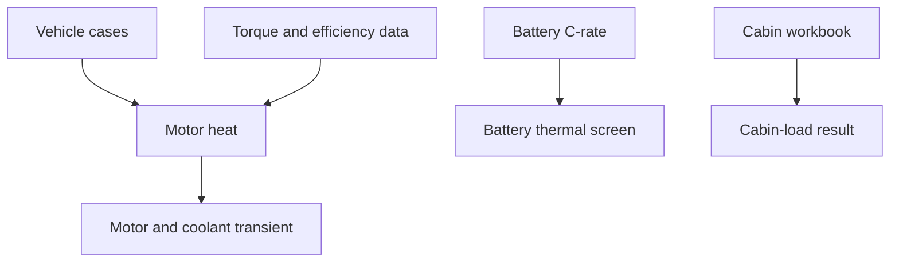

# Architecture

Only one cross-module interface remains: `motor_heat` passes its time-aligned
heat traces to `motor_cooling`. Battery and cabin results are independent.

| Layer | Responsibility |
|---|---|
| `config/` | Editable boundaries and explicitly assumed calibration values |
| `data/` | Original curves, schedules, workbook and derived numerical inputs |
| `modules/` | Four independent workflows and exports |
| `src/calculations/` | Reusable equations |
| `tests/` | Regression, energy-balance and interface checks |

The active model contains no compressor, refrigerant circuit or shared
battery/cabin capacity allocation.
