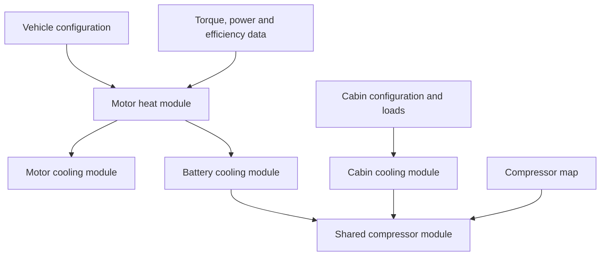

# Architecture

## Calculation dependencies

There are two intentional cross-module interfaces:

| Producer | Consumer | Interface |
|---|---|---|
| Motor heat | Motor cooling | Cycle summary containing average and peak integrated-drive heat |
| Motor heat | Battery cooling | Time-aligned `DCLinkPower_kW` trace |
| Battery cooling | Shared compressor | Time-aligned plate cooling request and battery summary |
| Cabin cooling | Shared compressor | Independent cabin-duty summary |

No module reads another module's configuration file. `run_all.m` owns the
dependency order and passes result structs explicitly.

## Physical circuits

### System cooling loops

### Propulsion coolant loop

The MATLAB release treats the shared refrigerant system as a capacity
allocation problem. It does not solve pressure, enthalpy, charge inventory or
branch-valve dynamics.

## Software layers

| Layer | Responsibility |
|---|---|
| `config/` | User-editable component and boundary parameters |
| `data/` | Maps, curves, scenarios and source-derived geometry |
| `modules/` | Domain workflows and domain-specific exports |
| `src/calculations/` | Unit-testable equations without vehicle ratings |
| `src/io/` | Deterministic file import and schema checks |
| `tests/` | Numerical regressions and forbidden-coupling checks |

New physics belongs in `src/calculations/`; new study values belong in the
relevant `config/` or `data/` domain.

The generated-file interface is listed in
[`RESULT_FILES.md`](RESULT_FILES.md).
