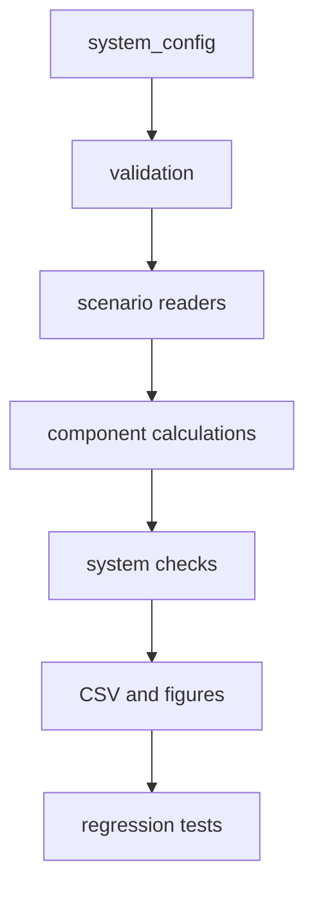
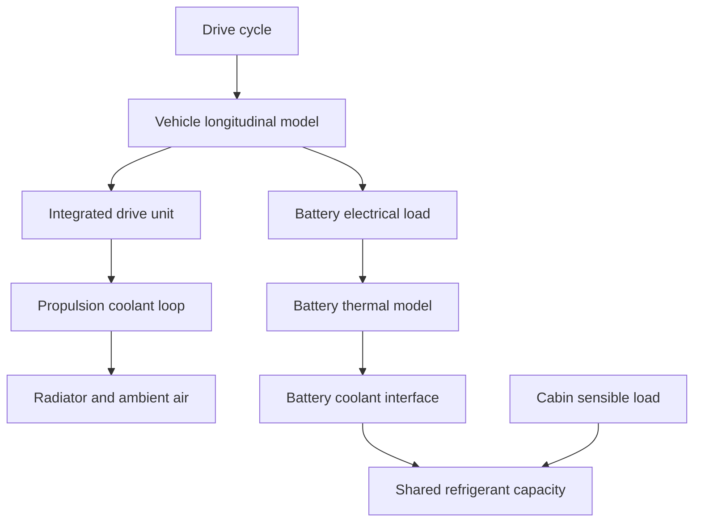

# Software Architecture

## Execution flow

`run_all.m` coordinates the workflow but contains no component ratings. Domain-level functions in `examples/` assemble reusable functions from `src/calculations/`.

## Physical-system boundary

The propulsion coolant loop is separate from the battery coolant/refrigerant branch. The model exchanges calculated heat duties between domains; it does not solve a full refrigerant state network.

## Extension rule

Add new vehicle or component data through `config/` and `data/`. Add new physics through a calculation function with a defined input/output interface and a regression test. Do not put component constants inside calculation functions.
