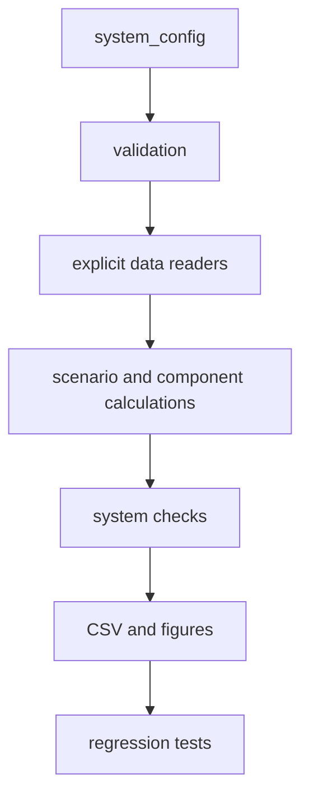
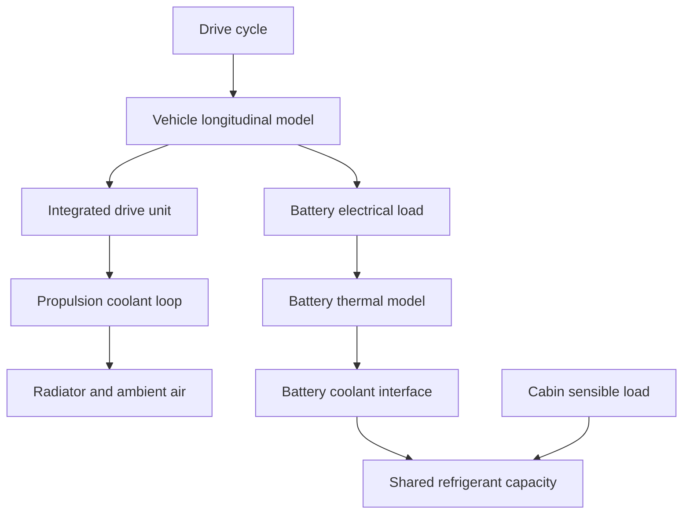

# Software Architecture

## Execution flow

`verify_framework.m` executes the complete analysis and regression checks.
`run_all.m` coordinates the engineering workflow but contains no component
ratings. Domain-level functions in `examples/` assemble reusable calculations
from `src/calculations/`. Project-controlled CSV inputs pass through
`src/io/read_project_csv.m`, which fixes the delimiter and validates the schema
before data reaches a calculation.

## Physical-system boundary

The propulsion coolant loop is separate from the battery coolant/refrigerant branch. The model exchanges calculated heat duties between domains; it does not solve a full refrigerant state network.

## Extension rule

Add new vehicle or component data through the root-level `system_config.m` and
`data/`. Add new physics through a calculation function with a defined
input/output interface and a regression test. Do not put component constants
inside calculation functions.
