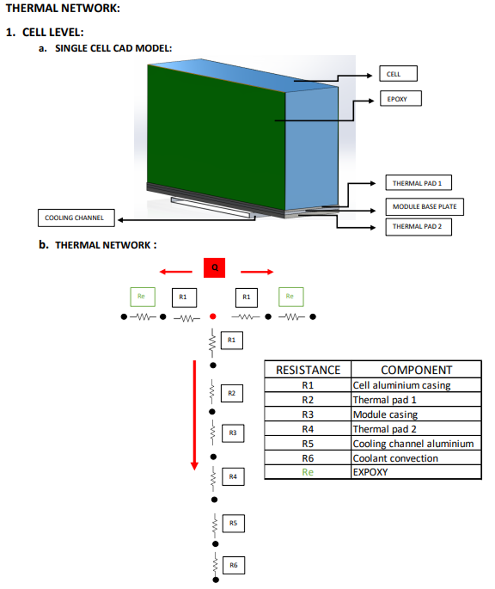
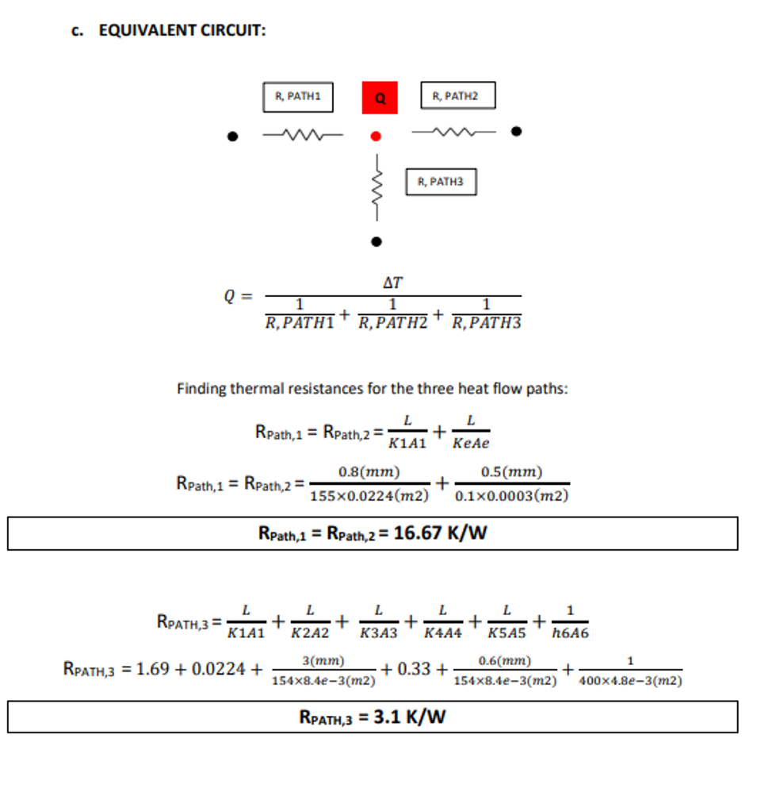
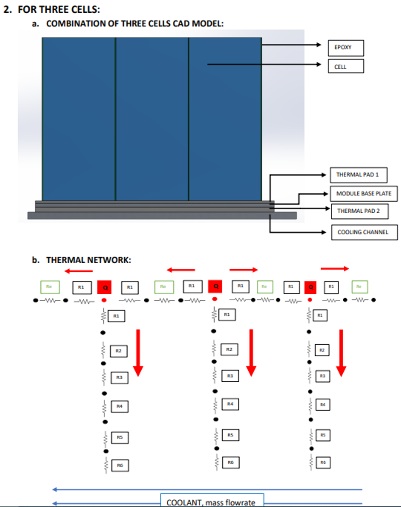
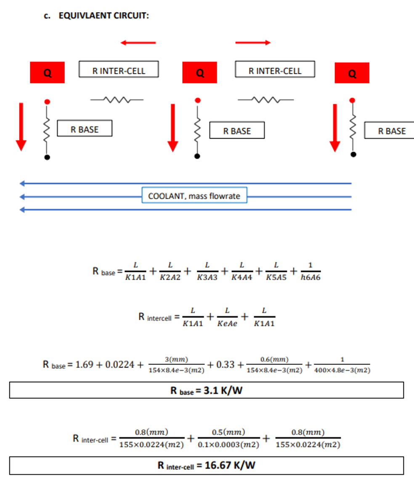
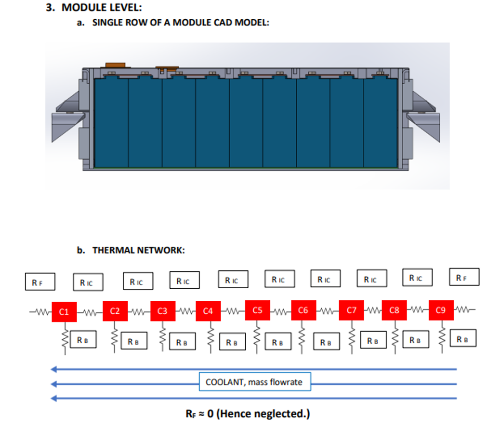

# Battery sustained thermal screen

The active battery model uses only the SVOLT 134 Ah specification and the
reconstructed 3.10 K/W cell-base thermal path.

| Input | Value | Status |
|---|---:|---|
| Capacity | 134 Ah | SVOLT specification |
| ACR | <=0.40 mOhm | 1 kHz, 25 C, 60% SOC; lower-bound proxy |
| Continuous discharge | 2C maximum | SVOLT specification at 25 +/- 3 C |
| Charging cutoff | 55 C | SVOLT continuous-charge table |
| Absolute limit | 60 C | SVOLT protection requirement |
| Base thermal path | 3.10 K/W | Reconstructed; requires validation |

The model reports minimum ohmic heat and the maximum coolant temperature that
would keep the cell at 55 C or 60 C under a sustained load. It does not impose
a coolant temperature or simulate a transient cell state.

## Archived thermal-network figures

The lateral resistances are not used as external heat-rejection paths. A
spatial model would need one temperature state per cell before lateral
conduction could be represented correctly.
