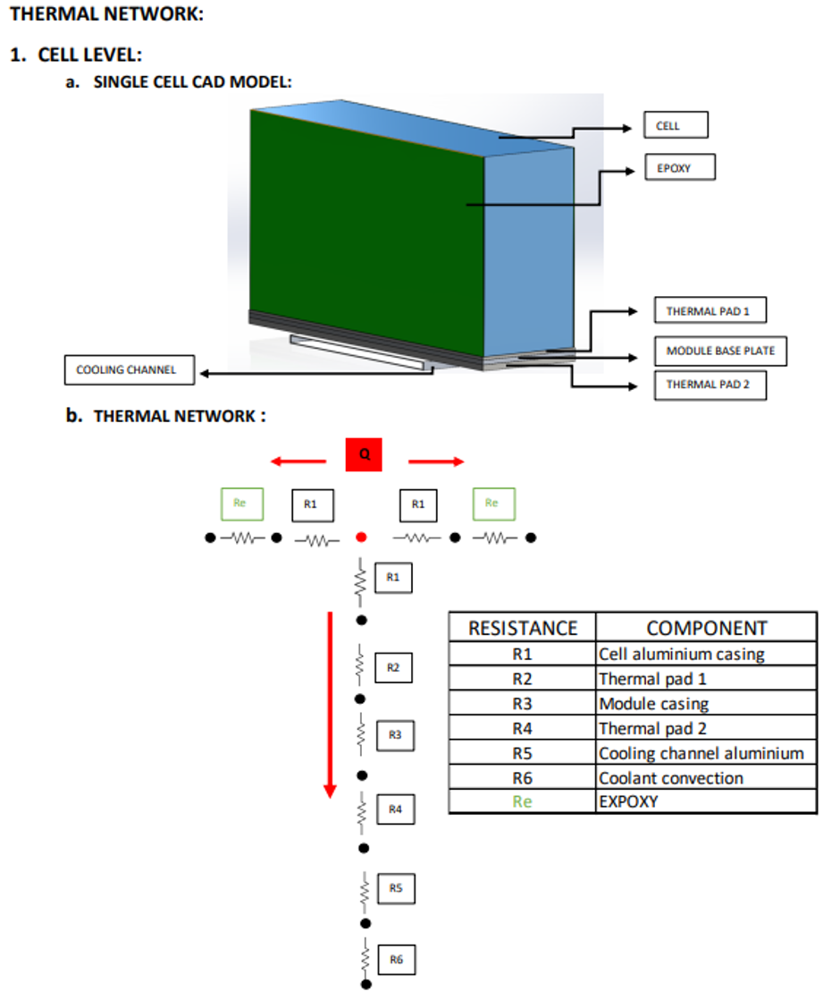
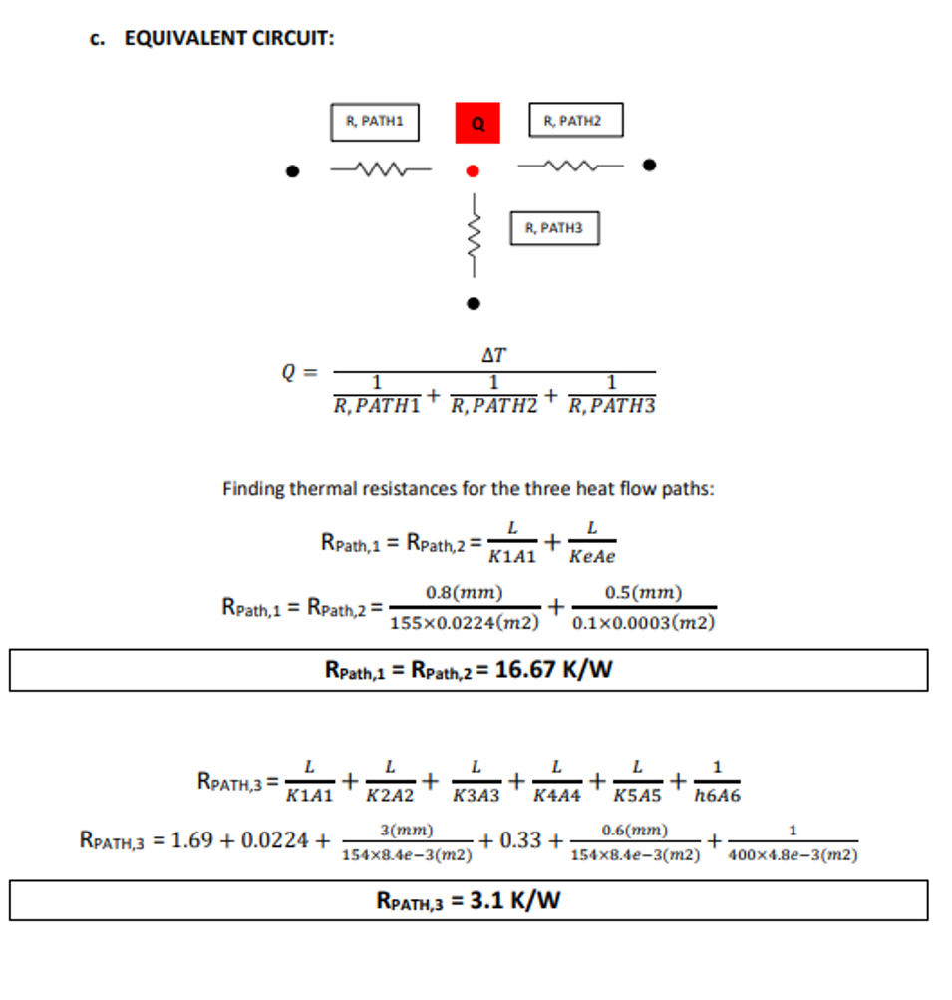
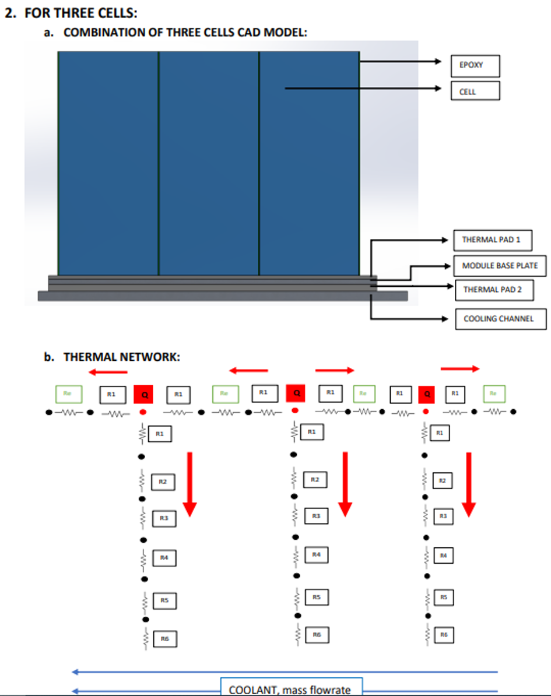
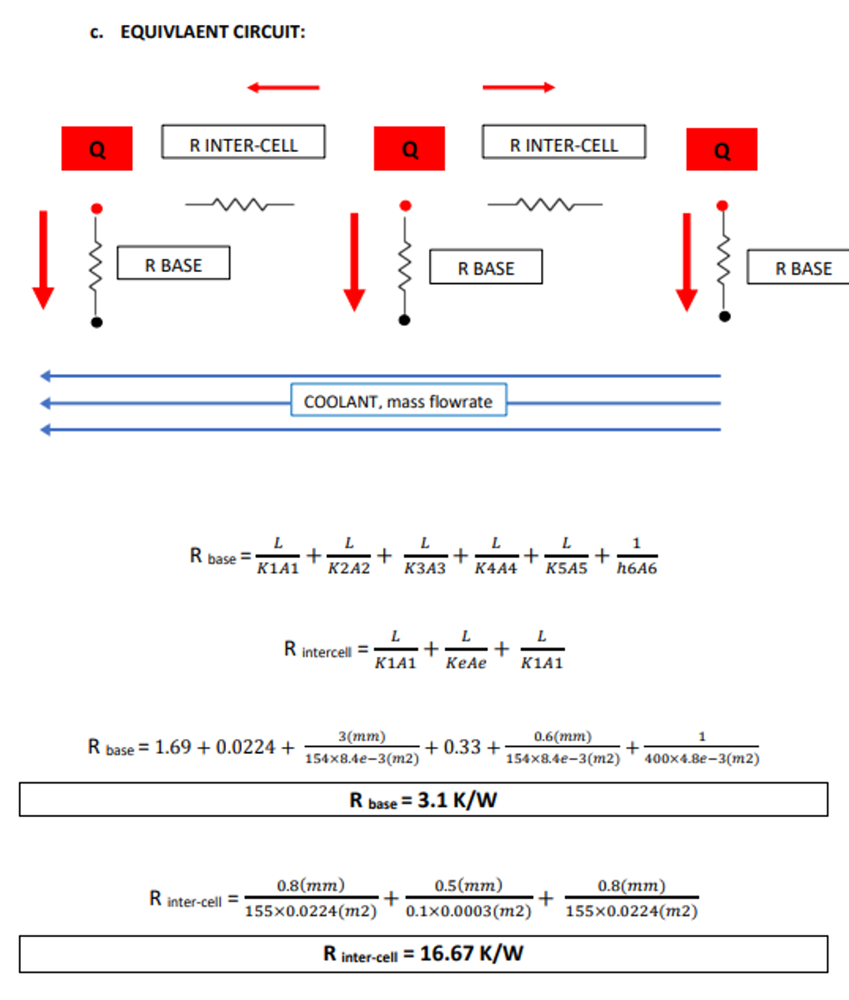
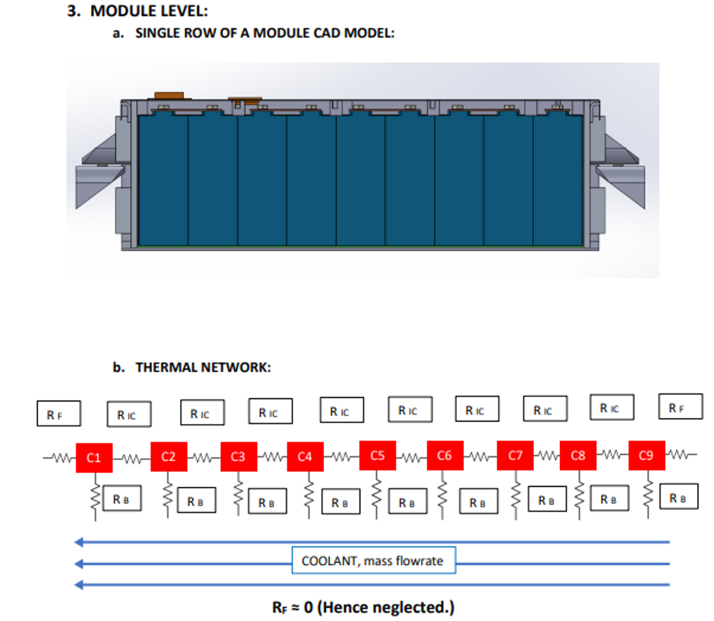

# Battery sustained thermal screen

The active battery model uses the SVOLT 134 Ah specification and a
cell-to-coolant path built from sourced literature values. The superseded
3.10 K/W reconstruction is kept for comparison; see
[`CORRECTIONS.md`](CORRECTIONS.md).

| Input | Value | Status |
|---|---:|---|
| Capacity | 134 Ah | SVOLT specification |
| ACR | <=0.40 mOhm | 1 kHz, 25 C, 60% SOC |
| DC resistance | 0.571 mOhm | ACR / 0.7 at 25 C; range 0.44-0.80 mOhm |
| Entropic coefficient | -0.37 mV/K peak | Low-SOC LFP value; adds about 15 W per cell at 1C |
| Continuous discharge | 2C maximum | SVOLT specification at 25 +/- 3 C |
| Charging cutoff | 55 C | SVOLT continuous-charge table |
| Absolute limit | 60 C | SVOLT protection requirement |
| Cell-to-coolant path | 0.458 K/W | Bottom-cooling build-up including the internal base insulator; 5-95% 0.37-0.59 K/W |
| Superseded base path | 3.10 K/W | Reconstruction; above even the 2.70 K/W worst case |

The screen reports cell heat and the maximum coolant temperature that keeps
the cell at 55 C or 60 C under a sustained load. The lumped discharge
transient in `modules/literature_gap_fill` adds cell temperature against
time for fixed coolant temperatures.

## Archived thermal-network figures

The lateral resistances are not used as external heat-rejection paths. A
spatial model would need one temperature state per cell before lateral
conduction could be represented correctly.
