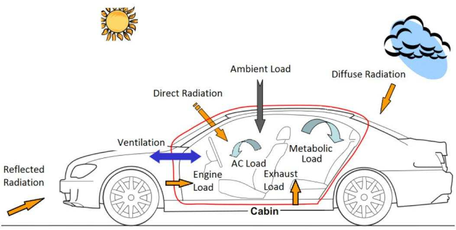

# Cabin cooling model

The figure identifies the full cabin heat-load structure: ambient conduction,
direct and diffuse solar radiation, reflected radiation, ventilation,
occupants and internal sources.

The current MATLAB input reproduces only the recoverable sensible-load subtotal
from the archived workbook. Solar, latent, ventilation and transient pull-down
loads are deliberately excluded until their source conditions can be restored
and validated for Karachi weather.
