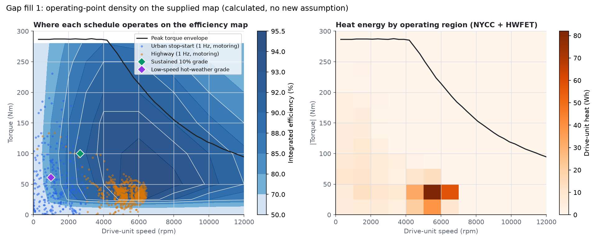
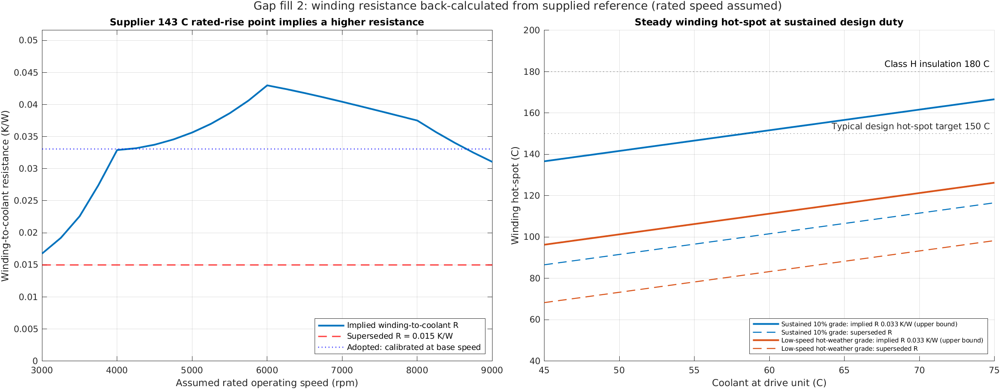
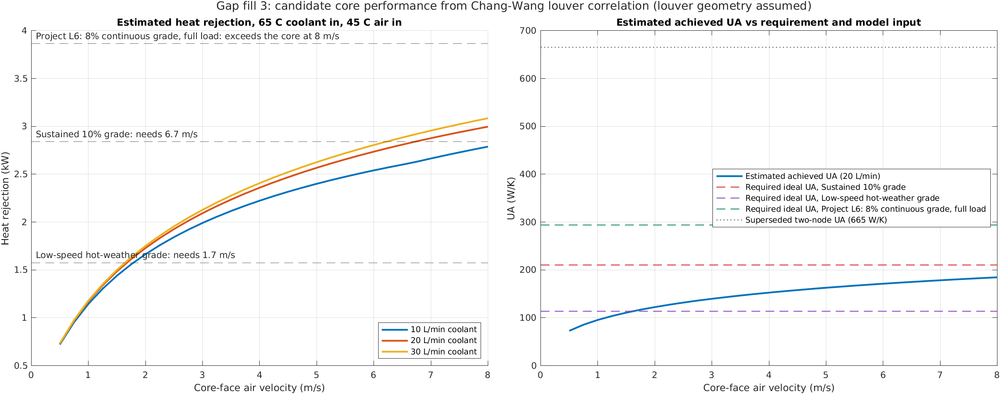
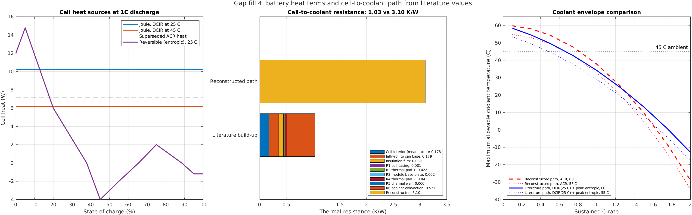
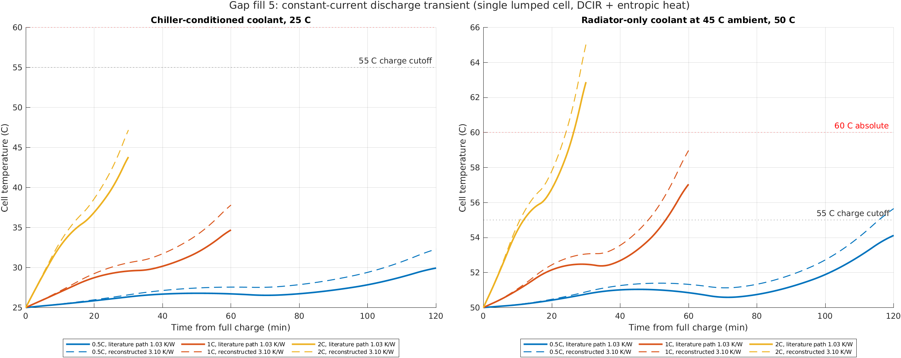
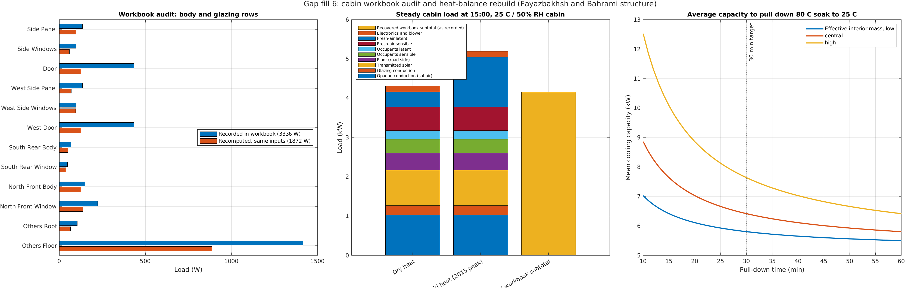

# Literature gap fill

This page shows the estimate figures behind the corrections, each drawn in
the form the related studies use. The argument for each correction (what
was wrong, how the new value is derived, whether it survives its assumption
ranges) is in [`CORRECTIONS.md`](CORRECTIONS.md).

Every literature number lives in
[`data/literature/literature_assumption_register.csv`](../data/literature/literature_assumption_register.csv)
with a central value, a low/high range, a source and the project input it
stands in for. `src/calculations/apply_literature_corrections.m` feeds the
central values into the model; `modules/literature_gap_fill` writes the
estimate tables and figures to `outputs/literature_gap_fill/`. All figures
are MATLAB outputs from the CI workflow.

| Gap | Estimate | Effect on the model |
|---|---|---|
| Battery cell-to-coolant path | 1.03 K/W: project network corrected, pads from the TG-A1250 datasheet, plus cell internals | Replaces the 3.10 K/W network result |
| Battery heat | DC resistance = ACR/0.7 plus low-SOC entropic heat | Replaces the 1 kHz ACR heat floor |
| Battery transient | Lumped cell, 2.66 kJ/K | New: cell temperature during full discharges |
| Radiator performance | Chang-Wang louver j-factor, e-NTU | Two-node UA 140/122 W/K replaces 665/300 W/K; the 10% grade needs about 6.7 m/s face velocity |
| Radiator pressure drop | Laminar flat-tube friction | About 0.6 kPa at 20 L/min |
| Winding resistance | Back-calculated from the supplier 143 C rated point (60 kW, 125 Nm) | 0.0340 K/W replaces 0.015 K/W |
| Cabin workbook | Row-by-row recomputation | Body and glazing 1.87 kW, not 3.34 kW |
| Cabin load | Heat-balance rebuild | 4.31 kW (dry heat) to 5.19 kW (humid heat), plus 0.6-2.4 kW for a 30-minute pull-down |
| Climate | 45 C with 25% or 44% RH | Replaces 45 C / 70% RH, which has an impossible 38 C dew point |

## Gap fill 1: drive-unit operating points

No new assumption. Motor and inverter papers show the drive cycle as a
scatter or energy-density map on top of the efficiency contours, because it
shows *where* the heat comes from. Here, highway heat is concentrated at
5000-7000 rpm and below 50 Nm. The digitized map has torque rows at 0, 25 and
50 Nm, and the 0 Nm row is a flat 50% placeholder. Below 25 Nm the heat
therefore comes from interpolating toward that placeholder. The low-torque
rows of the map matter more to cycle heat than its peak-efficiency island.

## Gap fill 2: winding-to-coolant resistance

The supplier reference gives 143 C winding with 60 C coolant at rated
conditions. The supplier sheet puts the rated point at 60 kW and 125 Nm, so
4584 rpm. Subtracting the 1.58 kW controller loss from the motor-system loss
there gives the motor loss; divided into the 83 K rise it is the implied
winding-to-coolant resistance (0.0340 K/W, the marked point). The left panel
still sweeps the speed from 3000 to 9000 rpm to show how sensitive the
calibration would be to a wrong rated point. LPTN studies plot
winding hot-spot against coolant temperature with the insulation-class limit,
and the right panel follows that form. The full integrated loss is pushed
through the winding path, so the solid lines are upper bounds.

## Gap fill 3: radiator achieved performance

Supplier radiator maps plot heat rejection against air face velocity, with
one curve per coolant flow, at a fixed inlet temperature difference. This
figure uses the same form and overlays the two sustained duties. Air side:
Chang and Wang (1997) generalized louvered-fin correlation with assumed louver
pitch 1.0 mm, angle 27 degrees and length 0.85 of the fin height. Coolant side:
laminar flow (Re about 550) in the 25.6 by 1.6 mm tube bore, Nu 6.45. Coolant-side
resistance is 30 to 45% of the total. A turbulator or dimpled tube would change
the result more than any louver assumption would.

The ideal-UA requirement and the estimated UA are not compared at the same
air flow. At 6.7 m/s the air rises less than 10 K, so a lower UA meets the
duty. Read the left panel for the duty check.

## Gap fill 4 and 5: battery heat, path and transient

Battery thermal papers show three things: the Bernardi heat terms against SOC,
a thermal-resistance stack, and cell temperature against time for several
C-rates at fixed coolant inlet temperatures. The two figures follow that
layout.

The resistance stack follows the project battery network (R1-R6) with the
cell geometry its areas imply (200 x 42 x 112 mm), R1 recomputed from the
stated 0.8 mm aluminium, and the cell-internal terms added. The network as
written sums to 2.57 K/W, not the 3.10 K/W it reports; see
[`CORRECTIONS.md`](CORRECTIONS.md) section 1.

The radiator-only panel is the decision-relevant one for Karachi. Without a
chiller the coolant cannot fall below ambient. With 50 C coolant the cell
reaches 57.6 C at 1C and 63.5 C at 2C, above the 60 C absolute limit.

## Gap fill 6: cabin workbook audit and heat-balance rebuild

The audit keeps every workbook input and recomputes each row:

- Glazing and door rows use `Q = U A SCL`. SCL is a solar cooling load in
  W/m2 and multiplies the shading coefficient, not `U`. Doors are opaque and
  take no SCL.
- The west rows repeat the east `Q` values even though their SCL is 112
  instead of 52.
- The CLTD correction `(78 - ti) + (tm - 85)` is the Fahrenheit form, but it is
  applied with 23 C and 38 C. The table CLTDs are Fahrenheit differences used
  as kelvin.
- The floor uses a roof CLTD (90 F) and contributes 1.42 kW, 42% of the
  subtotal.
- The workbook's outdoor temperature is 38.1 C, not the 45 C design boundary.

Fayazbakhsh and Bahrami (SAE 2013-01-1507) present cabin load as a stacked
breakdown by source, plus a pull-down transient. The rebuild uses that
breakdown with the workbook areas and U-values, ASHRAE clear-sky irradiance
for 15:00 on 21 June at 24.9 N, sol-air temperatures and fresh-air
psychrometrics. The pull-down panel shows mean capacity against target time
for three interior thermal masses. That mass is the least certain input.

## How to retire each assumption

| Register rows | Replace with |
|---|---|
| R01-R03, R06 | Louver drawing of the selected core, or a supplier heat-rejection map |
| B01-B02 | HPPC DCIR at 0, 25 and 45 C for the SVOLT cell |
| B10-B19 | Measured cell-to-plate step response (one heated cell on the plate) |
| B20-B21 | Cell mass and calorimetric specific heat |
| M01 | Rated speed and torque for the 143 C winding reference |
| C10-C25 | Soak and pull-down test of the vehicle, or a calibrated cabin CFD |
| K02-K03 | NASA POWER or PMD hourly records for Karachi, using coincident humidity |

## Sources

- Chang, Y.-J. and Wang, C.-C. (1997). A generalized heat transfer correlation
  for louver fin geometry. *Int. J. Heat Mass Transfer* 40(3), 533-544.
- Shah, R.K. and London, A.L. (1978). *Laminar Flow Forced Convection in
  Ducts*. Academic Press.
- Fayazbakhsh, M.A. and Bahrami, M. (2013).
  [Comprehensive Modeling of Vehicle Air Conditioning Loads Using Heat Balance Method](https://saemobilus.sae.org/content/2013-01-1507).
  SAE 2013-01-1507.
- ASHRAE Handbook Fundamentals: clear-sky model, occupant heat gains,
  glycol properties.
- [Battery Design: DCIR of a cell](https://www.batterydesign.net/battery-cell/dcir-of-a-cell/)
  (ACIR about 70% of 10 s DCIR).
- [Battery Design: thermal management and TIM](https://www.batterydesign.net/thermal/).
- [Entropic coefficient measurement for LFP](https://arxiv.org/pdf/2111.01776)
  and published LFP/graphite entropic profiles for the dU/dT shape.
- [Ministry of Climate Change: Karachi heat wave technical report, June 2015](https://mocc.gov.pk/SiteImage/Misc/files/Final%20Heat%20Wave%20Report%203%20August%202015.pdf)
  (44.8 C with a 66 C heat index).
- [SVOLT 134Ah cell listing](https://www.evlithium.com/LiFePO4-Battery/svolt-134ah-lifepo4-battery-cell.html)
  (dimensions and mass; confirm against the cell drawing).
